<h1>Sanhita</h1>

**A regulation compiler for India's securities markets.**

> Probabilistic in the loop. Deterministic at the core. Human certified at the boundary.

SEBI publishes regulation as prose in a PDF.

Every broker in the country reads that PDF, decides what it means, and writes
the answer into a spreadsheet.

Sanhita compiles it instead. Into typed rules that a machine can run, a named
human has signed, and an inspector can trace back to an exact clause and its
hash.

**Live at [sanhita.fly.dev](https://sanhita.fly.dev)**

Built for the **SEBI Securities Market TechSprint 2026**, Problem Statement 2,
*Agentic Compliance, From Regulatory Text to Operational Action*.

*Sanhita*, Sanskrit, a systematically compiled body of law.

---

## At a glance

| | | | |
|---:|---|---:|---|
| **1,720** | clauses parsed | **1,377** | obligations compiled |
| **1,070** | carry a duty | **183** | signed by a named officer |
| **954 ms** | to compile the whole circular | **$0.00** | to compile it |
| **0.875** | F1 against a human gold set | **990** | tests, all passing |

One real SEBI amendment carried end to end. Zero LLM calls at evaluation time.
No chatbot, and three tests that fail the build if anyone adds one.

---

## Contents

**Start here**
[The one thing worth understanding](#the-one-thing-worth-understanding) ·
[The problem, in SEBI's own words](#the-problem-in-sebis-own-words) ·
[Architecture](#architecture) ·
[Live](#live) ·
[Quick start](#quick-start) ·
[What is actually in here](#what-is-actually-in-here)

**The pipeline, stage by stage**
[1 Reading the PDF](#stage-one-reading-the-pdf) ·
[2 The clause tree](#stage-two-the-clause-tree) ·
[3 The Obligation IR](#stage-three-the-obligation-ir) ·
[4 Extraction](#stage-four-extraction) ·
[5 Human certification](#stage-five-human-certification) ·
[6 Deterministic execution](#stage-six-deterministic-execution) ·
[7 The remediation loop](#stage-seven-the-remediation-loop)

**What the typed rules make possible**
[Operational mapping](#operational-mapping) ·
[Amendments](#amendments) ·
[Cross rule analysis](#cross-rule-analysis) ·
[Coverage and its denominator](#coverage-and-its-denominator)

**How you check us**
[Determinism](#determinism) ·
[Provenance](#provenance) ·
[Performance](#performance) ·
[Every screen](#every-screen) ·
[Testing](#testing) ·
[Honest limits](#honest-limits) ·
[Where every number came from](#where-every-number-came-from)

**Running it**
[Repository layout](#repository-layout) ·
[Deployment](#deployment)

---

## The one thing worth understanding

Most compliance tools answer questions. Sanhita refuses to.

An answer you cannot audit is not compliance, and a regulator knows it.

So the model never decides anything. It proposes a rule once. A named officer
signs that rule once. From then on the rule runs as pure logic: same evidence
in, same answer out, every time, forever.

There is no search box. There is no chat. Three tests fail the build if anyone
adds one.

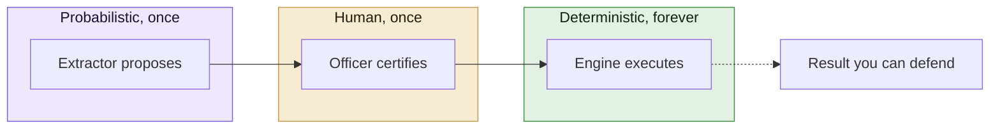

**Why this shape and not a chatbot.**

A language model asked whether a firm is compliant will give a fluent answer, a
different one next Tuesday, and no way to show an inspector why.

Moving the model to the front of the pipeline, where it drafts something a
person then signs, keeps the useful part and discards the part nobody can
defend.

---

## The problem, in SEBI's own words

Problem Statement 2 names two challenges and one root cause.

**Dynamic regulatory translation.** Interpreting a new or amended requirement,
mapping it to the affected intermediary's operational processes, and updating
compliance workflows in a timely and consistent manner.

**Ongoing compliance management.** Tracking existing obligations, mapping each
to evidence of fulfilment, maintaining audit trails, and identifying and
remediating compliance gaps before they become regulatory findings.

And the root cause, quoted exactly.

> The regulatory framework exists as unstructured, human-readable text, while
> operational compliance systems require structured, machine-actionable rules.
> Bridging this gap, transforming regulatory intent into programmable, auditable
> compliance logic, is the core unsolved problem.

### How each requirement is answered

| What PS 2 asks for | Where it lives |
|---|---|
| Interpret a new or amended requirement | `parse/`, `compile/` |
| Map it to operational processes | `controls.py`, the `/processes` screen |
| Update compliance workflows | `remediate/` |
| Track existing obligations | `certify/lifecycle.py`, the queue |
| Map each obligation to evidence | `ir/schema.py` EvidenceReq, `execute/evidence.py` |
| Maintain audit trails | `certify/ledger.py`, hash chained |
| Identify gaps | `execute/engine.py`, `execute/applicability.py` |
| **Remediate gaps** | `remediate/tasks.py`, `remediate/service.py` |
| Specify intermediary and corpus | Stock brokers, Master Circular 17 June 2025 |
| Demonstrate a concrete scenario | `tests/test_remediation_web.py` |

---

## Architecture

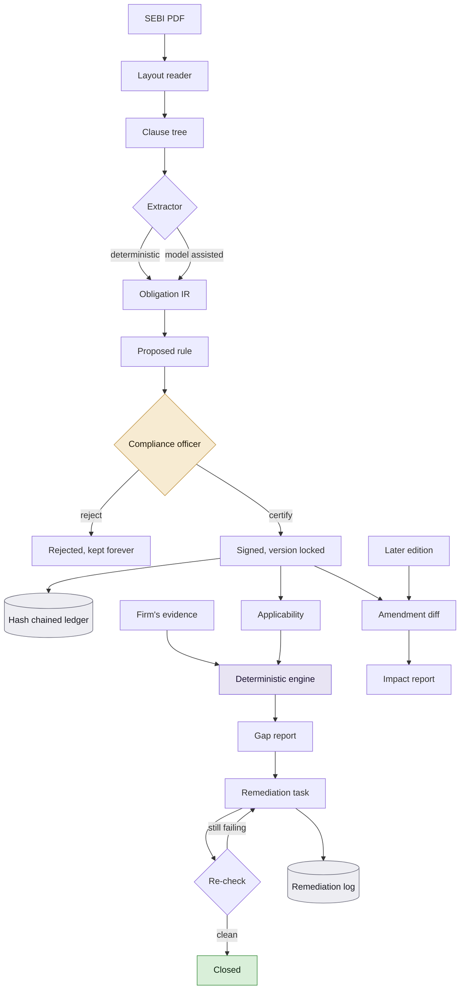

Four separate files on disk, and the separation is deliberate.

| File | Holds | Whose fact is it |
|---|---|---|
| `rules.json` | rulebook, signatures, audit ledger | the regulator's text |
| `evidence.json` | what the firm filed and when | the firm's records |
| `controls.json` | process, team, system, procedure | how the firm is organised |
| `remediation.json` | tasks and their hash chained log | what the firm did about a finding |

Recording a control binding never alters the bytes a signature covers. That is
the property that lets a firm reorganise without invalidating 183
certifications.

---

## Live

### [sanhita.fly.dev](https://sanhita.fly.dev)

Opens on the demonstration firm with a position already recorded.

Everything is readable without an account. Recording a compliance action needs
one, and signing up takes a moment.

Your work is yours alone. The first change you make forks the demonstration
into your own copy, and nobody else sees it.

---

## Quick start

```bash
pip install -e ".[dev,web]"
sanhita serve
```

Open `http://127.0.0.1:8000`.

The stock broker circular is committed to the repository, already parsed,
compiled and partly certified, so a clean clone has something real to look at
immediately.

Accounts need a signing key, because sessions are signed.

```bash
export SANHITA_SIGNING_KEY=$(python -c "import secrets; print(secrets.token_hex(32))")
```

### Recording a demonstration

```bash
sanhita demo-seed          # a clean synthetic firm, officer, records and assessment
python make-submission.py  # the archive, without anybody's accounts or records
```

`demo-seed` **generates** the demonstration state rather than curating it, so it
is the same every time and contains nothing belonging to a person:

- one synthetic firm, marked as synthetic
- one officer at a `.invalid` address
- four filing occasions, of which one was never filed
- one recorded assessment, attributed to that officer

Existing data is moved into a timestamped backup folder rather than deleted, and
`rules.json` is read and never written.

`make-submission.py` writes `dist/sanhita-submission-<date>.zip` and prints what
it kept out and why. Accounts, uploaded circulars and a firm's own records never
leave. The compiled rulebook and SEBI's own circular do, because a clone that
boots to an empty screen demonstrates nothing.

### The command line

```bash
sanhita ingest                 # parse and report what was read
sanhita tree --section 21      # inspect the clause tree
sanhita compile                # deterministic extraction
sanhita certify-section 15     # sign a section
sanhita coverage --explain     # coverage with its full denominator
sanhita conflicts              # where the circular disagrees with itself
sanhita structure              # what this circular costs a firm per year
sanhita missing                # duty bearing clauses with no rule
sanhita schedule               # what falls due, and when
sanhita execute                # run certified rules against evidence
sanhita diff <before> <after>  # compare two editions
sanhita eval                   # score extraction against the gold set
sanhita verify                 # re-parse and assert every hash is unchanged
sanhita audit                  # walk the hash chained ledger
sanhita export-rego            # OPA policy export
sanhita receipt <clause>       # a signed attestation for one rule
sanhita bench                  # time every stage of the pipeline
sanhita serve                  # the workbench
```

### With Docker

```bash
docker build -t sanhita .
docker run -p 8000:8000 -e SANHITA_SIGNING_KEY=$(openssl rand -hex 32) sanhita
```

The image carries the circular and the compiled rulebook, so the container
serves every screen with the network unplugged.

There is exactly one place it would reach out, and only when a person presses
it: the "Check SEBI now" button reads sebi.gov.in's own circulars listing.
Nothing else, nothing scheduled, and nothing on page load.

---

## What is actually in here

Measured on the SEBI Master Circular for Stock Brokers, 17 June 2025.

| | |
|---|---:|
| Pages | 399 |
| Characters extracted | 765,120 |
| Nodes in the clause tree | **2,717** |
| Clauses parsed, main body | **1,720** |
| Clauses carrying a duty | **1,070** |
| Obligations compiled | **1,377** |
| Certified and signed | **183** |
| Audit ledger entries | **1,560** |
| Time to compile the whole circular | **954 ms** |
| Cost to compile it | **$0.00** |
| Tests | **990** |

**Two clause counts, because there are two honest populations.**

The tree holds 2,717 nodes. 996 of those are annexure nodes and one is an
appendix. Coverage is quoted over the 1,720 that remain, so a form reproduced
in an annexure cannot inflate the denominator.

The benchmark reports the tree it actually built, which is why it says 2,717.
Both numbers are right; neither is the other.

### Coverage as three numbers rather than one

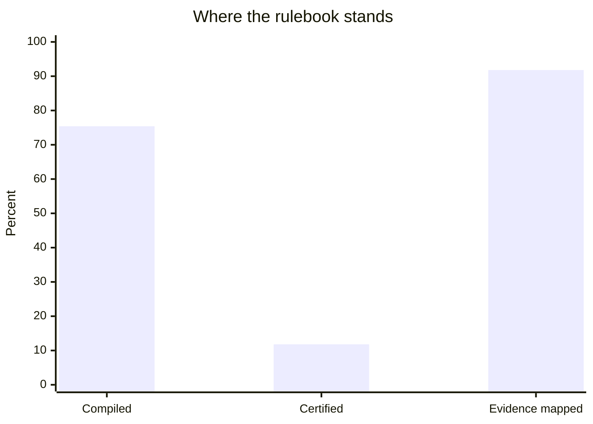

| Rung | Value | Of what | Limited by |
|---|---:|---|---|
| Compiled | **75.4%** | 807 of 1,070 duty bearing clauses | the extractor |
| Certified | **11.8%** | 126 of 1,070 duty bearing clauses | **reviewer hours, by design** |
| Evidence mapped | **91.8%** | 168 of 183 certified rules | whether the clause names an artifact |

**Read the middle number carefully.** It is low because certification is a
human act and one reviewer has finite hours. It is not the compiler failing.

Quote all three or none.

---

## Stage one, reading the PDF

A circular is not a text file.

It is a laid out document with running headers, footnote rules, page numbers,
tables and two columns of margin notes. Every one of those is noise that will
end up inside a clause if the reader is naive.

`parse/layout.py` reassembles PyMuPDF runs into visual lines, then classifies
each one.

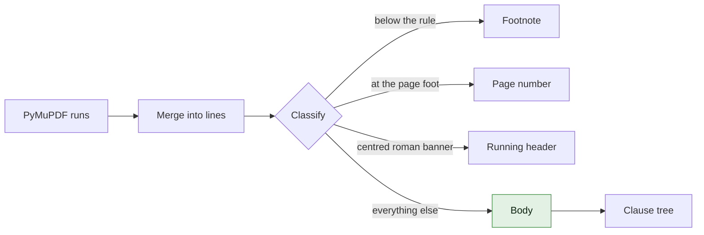

### Body text is measured, not assumed

The original version declared body copy to be 12pt, because that is what the
stock broker circular uses.

SEBI typeset the June 2025 research analyst circular at **11.3pt**. Every line
in it fell under the threshold, every line was classified as furniture, and a
document containing 139 well formed numbered clauses parsed to nothing.

The threshold is now the modal font size of the document itself, less a
tolerance of 0.7.

That number is not arbitrary. A 12pt document lands at 11.3, which admits and
excludes exactly what the old fixed 11.5 did, so the stock broker tree is
unchanged and its 183 signatures stay valid. A test fails if anybody widens it.

### Section margins are measured too

`_SECTION_MAX_X0` was 115 points. Every circular tested happens to sit under
that, which was luck rather than design.

It is now the fifth percentile of the document's own indents plus a band,
combined with the old constant so the result can only ever be **more**
permissive. A heading that qualified before still qualifies, which is what
keeps the tree stable.

Measuring found a live bug: the investment adviser circulars have wider margins,
and the fixed ceiling was cutting off a real section heading in each.

---

## Stage two, the clause tree

Clause numbering is authoritative. Indentation is corroborating.

Depth comes from the number of dotted components, and where the document's own
indentation disagrees, the clause is flagged rather than silently re-parented.

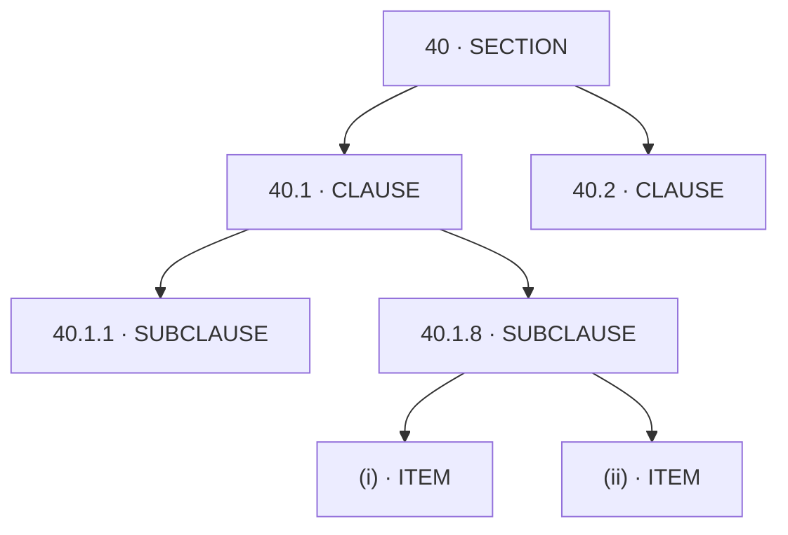

Every node carries an id, a page, a character span into the document text, and
a SHA-256 of its own text. Those four together are what lets a compiled rule
say *I came from clause 40.1.8, on page 95, at these bytes, and here is the
hash of the words I read*.

### Flat circulars

A master circular is an annual consolidation with bold numbered headings. An
ordinary circular is one or two pages with none, and its body is five numbered
paragraphs.

The tree builder only recognised the first shape, so short circulars parsed to
nothing. Those are the documents that arrive weekly and create the translation
problem in the first place, so dropping them dropped the wrong half.

`_parse_flat` runs **only when the structured pass found no numbered node at
all**, which is what keeps it from ever touching a document that parsed
normally.

Two rules, deliberately strict, because it runs on documents the main parser
could make no sense of.

- A clause opens at the document's own measured left margin
- Numbers may not go backwards, so a `1.` after a `5.` is a restarted list
  inside a paragraph rather than a sixth clause

---

## Stage three, the Obligation IR

The heart of the product. A clause becomes a typed object rather than a row in
a spreadsheet.

This is `SB-40.1.8-a` exactly as it sits in the shipped store, not a sketch of
one. Read it back with `sanhita propose --clause 40.1.8`.

> **40.1.8.** As like in derivatives segments, the TMs/CMs shall report to the
> Stock Exchange on T+5 day the actual short-collection/ non-collection of all
> margins from clients.

```python
Obligation(
    id="SB-40.1.8-a",
    actor=Actor.STOCK_BROKER,
    modality=Modality.MUST,
    action=Action(verb="report",
                  object="the actual short-collection/ non- collection of all "
                         "margins from clients",
                  recipient="Stock Exchange"),
    trigger=Trigger(kind=TriggerKind.CONTINUOUS, expression="always"),
    deadline=Deadline(kind=DeadlineKind.RELATIVE, offset_days=5,
                      anchor_event="trade.date",
                      business_days=DayCount.UNSPECIFIED),
    conditions=[],
    evidence=[EvidenceReq(artifact_type="REPORT_FILING",
                          producible_on_demand=True)],
    source=SourceAnchor(circular_id="SEBI/HO/MIRSD/MIRSD-PoD/P/CIR/2025/90",
                        clause_id="40.1.8", section="40", page=95,
                        char_span=(184271, 184443),
                        sha256="6d670a4b10d4b7df67fe421727214513"
                               "586bc6b586b6394bea2684a78deece48"),
    confidence=0.803,
    status=RuleStatus.PROPOSED,
)
```

Two things in there are the product arguing with itself, deliberately.

`business_days` is `UNSPECIFIED` because SEBI wrote *T+5 day* without saying
which. That single field is why this rule is still `PROPOSED`: an officer
cannot sign it until a person decides.

`char_span` and `sha256` are what let a finding two years from now say *I came
from these 172 characters on page 95, and here is their hash*.

### Three structural commitments

**Deadline and Commencement are different fields.**

A clause saying a requirement applies from 1 April is not a clause saying you
have until 1 April. Collapsing both into one date field is the single most
common way a compliance spreadsheet becomes wrong, and the type system refuses
to allow it.

**Day count is tri-state:** `BUSINESS`, `CALENDAR`, `UNSPECIFIED`.

SEBI often writes *within 30 days* without saying which, and the two readings
give different due dates. Silently applying the market convention would bake an
invisible interpretation into a signed artifact, which is precisely what this
product exists to eliminate.

`UNSPECIFIED` **blocks certification** until a named officer resolves it, and
their answer is recorded as theirs.

**Every field carries provenance.**

`field_provenance` maps each field to the character span that justified it.
That is what powers the hover interaction in the workbench, and it is also what
makes an unjustifiable field visible.

### Conditions hold prose, not predicates

931 conditions across the corpus. **94 of them, 10.1%, contain so much as a
comparator and a number.** The rest are judgement gates of the form *where the
circumstances so warrant*.

That 10.1% is measured with the product's own `_NUMERIC_CONDITION` pattern in
`analyse/divergence.py`, the same test the divergence screen uses to decide
whether a condition is a judgement. The figure and the screen cannot drift
apart.

The field description used to claim they were machine evaluable. They are not,
and it now says so. They are enough to show a reviewer why a rule might not
apply. They are not enough to feed a solver, and pretending otherwise would put
a language model inside something calling itself a proof.

---

## Stage four, extraction

Two engines behind one interface.

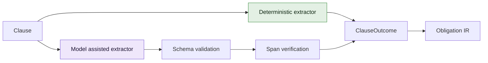

| | Deterministic | Model assisted |
|---|---|---|
| Whole circular | **954 ms** | roughly 40 hours |
| Cost | **$0.00** | real money |
| Network | none | an API call per clause |
| Reproducible | bit for bit | pinned model and prompt |
| Rules in the shipped store | **1,377** | **0** |

**Every rule in the shipped store came from the deterministic extractor.** The
model path exists, works, and produced none of them.

Run live against clause 40.1.8, the model found two obligations where the rules
engine found one. It correctly noticed the clause binds both a stock broker and
a clearing member, and it left the day count unresolved rather than assuming a
convention. It took **105 seconds** for that one clause.

So the model is reserved for text the rules cannot reach, rather than run over
everything.

Extraction never silently returns nothing either. A clause always produces
exactly one `ClauseOutcome`, carrying either obligations or the reason there
are none.

---

## Stage five, human certification

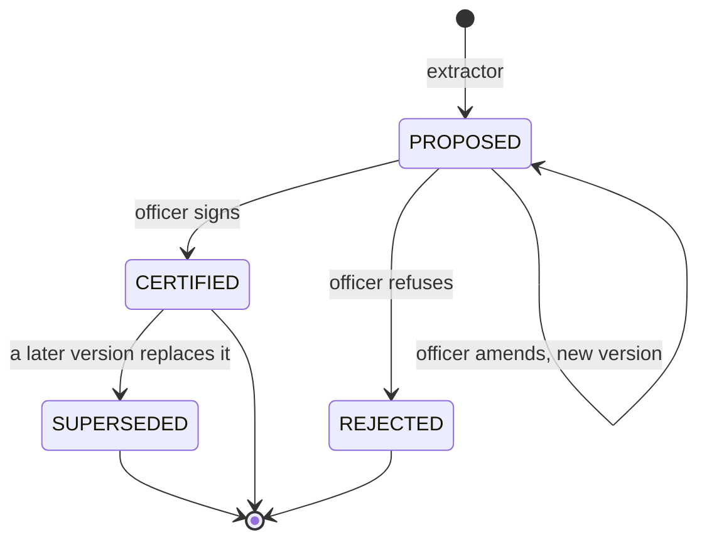

Certification is HMAC-SHA256 over the obligation's canonical bytes.

The payload is byte stable, so the same obligation always produces the same
signature input regardless of key ordering or float formatting.

**Certification is refused where a field is unresolved.**

An officer cannot sign a rule whose day count is `UNSPECIFIED`, or whose
deadline the clause did not settle. The workbench shows the blocking issue and
offers the resolution form instead of the certify button.

### The audit ledger

Append only, hash chained. Every entry carries the hash of the one before it.

```
  rules tracked                       1377
  ledger entries                      1560
  ledger head                         1007092cf7b2057c1ff6037c600888e7

  RECENT TRANSITIONS
    [1558] 2026-08-04T23:37:12Z  SB-62.8-a  PROPOSED -> CERTIFIED  by Sanhita Demo Officer
    [1559] 2026-08-04T23:37:12Z  SB-62.9-a  PROPOSED -> CERTIFIED  by Sanhita Demo Officer
```

`sanhita audit` walks the chain and prints its head. If an entry has been
altered, the chain stops verifying and the screen says which entry and why.

**And one thing the ledger cannot currently prove.** The HMAC key those 183
signatures were made with is lost, so `/audit/verify` reports 183 checked and 0
valid. The chain itself is unbroken. See [Honest limits](#honest-limits).

---

## Stage six, deterministic execution

Certified rules run against the firm's evidence.

No model is consulted at this point, so the same evidence always produces the
same answer.

### Applicability, and why silence is not innocence

The engine used to skip any rule with no evidence, on the reasoning that no
evidence is not a breach.

That is true of a rule which never fell due. It is false of one which fell due
twelve times and produced nothing, and the two were indistinguishable.

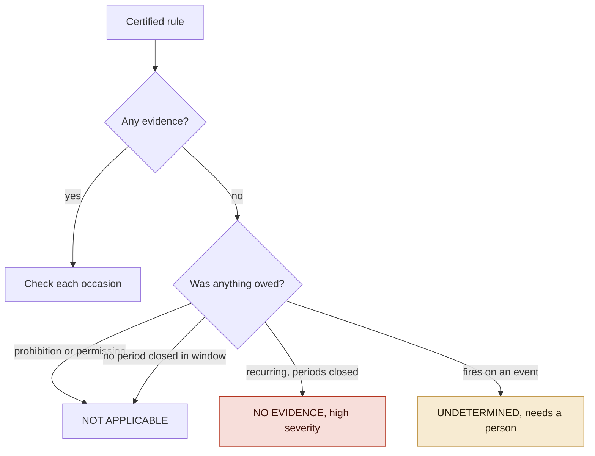

Run the real rulebook against a firm that has filed nothing and you get **30
findings**, 15 not applicable and 138 undetermined. Before this, zero.

Read the 30 carefully, because the split is the point.

Every one of them is `NO_EVIDENCE`. **Breaches: zero.** The firm has not been
caught doing anything wrong. It has 30 duties nobody can say either way about,
and the screen offers the upload rather than an accusation.

`UNDETERMINED` is never counted as a pass. A tool that looks safer the less it
understands is worse than no tool.

### The outcomes

| Outcome | Meaning |
|---|---|
| `SATISFIED` | the artifact was produced on or before the due date |
| `LATE` | produced, after the due date |
| `MISSING` | an occasion is recorded and its artifact never arrived |
| `NO_EVIDENCE` | the duty fell due and there is no record of it at all |

`MISSING` and `NO_EVIDENCE` are kept apart deliberately.

The first is a process that ran and failed. The second is a firm that does not
know it owes the duty. Only the first two rows are findings against a firm.

### Unevaluable is not a pass

A rule the engine cannot check is listed as unevaluable with the reason, never
counted as satisfied.

Silence there is how compliance tools come to report reassuring numbers that
mean nothing.

---

## Stage seven, the remediation loop

Finding a gap is a report. Closing one is work somebody owns.

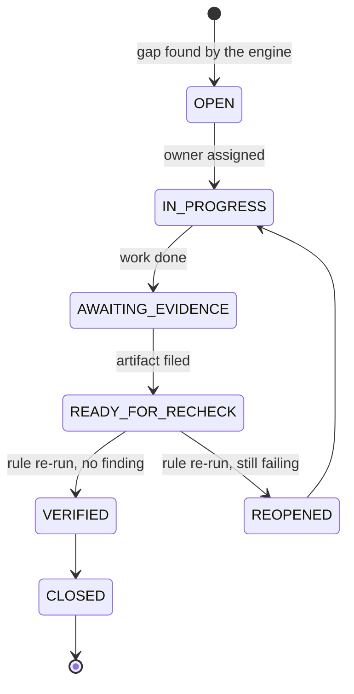

**Nothing closes because a person says it is fixed.**

`RemediationStore.set_status` physically refuses `VERIFIED` and `CLOSED`.

The only path to either is `recheck`, which runs the certified rule again
through the same engine that raised the finding. Three outcomes, and only one
closes anything.

| The engine returns | What happens |
|---|---|
| no finding for this rule | **VERIFIED, then CLOSED** |
| still a breach | **REOPENED**, back to the owner |
| declined to evaluate the rule | nothing, and the reason is logged |

**That third row matters.** A rule the engine will not evaluate produces no
findings, and treating that as a pass would let a task be closed by making the
rule uncheckable.

The service checks `rules_evaluated` before concluding anything, and a test
asserts closure cannot be obtained that way.

Every transition lands on an append only hash chained log, separate from the
certification ledger because remediation is a different kind of fact.

```
CREATED -> ASSIGNED -> EVIDENCE_ATTACHED -> RECHECKED -> VERIFIED -> CLOSED
```

---

## Operational mapping

PS 2 asks for a requirement mapped to the affected intermediary's operational
processes.

Knowing a rule binds *a stock broker* names a category of firm, not a part of
one. Nobody can be handed that.

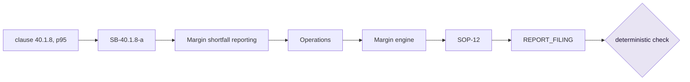

The clause, the obligation id and the evidence type are the real ones. The
process, function, system and control are what a firm records about itself, so
they are that firm's own words and Sanhita never invents them.

| Term | Answers |
|---|---|
| Function | *who* |
| System | *where* |
| Control | the *written procedure* |
| Process | *the part of the business the duty attaches to* |

**Bound and mapped are counted separately.** A rule bound to Operations and
nothing else has an owner but does not tell anybody what to go and fix.

**Systems are counted.** A system carrying many duties is a single point of
failure the firm may not have noticed. If its export format changes, every duty
above it loses its evidence at once.

Bindings live in `controls.json`, never inside the signed bytes. A test asserts
that adding a full chain leaves the obligation's canonical JSON byte identical.

---

## Amendments

SEBI issued a Master Circular for Investment Advisers in June 2025 and reissued
it in February 2026. Both PDFs are in `corpus/`.

This is a genuine amendment, not an edit applied by hand.

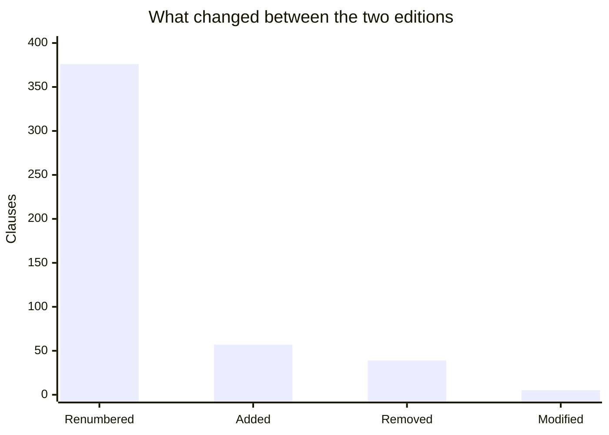

| | Clauses |
|---|---:|
| Renumbered | **376** |
| Added | 57 |
| Removed | 39 |
| Modified | 5 |
| Unchanged, keeping their number | 0 |

**The renumbering is the finding.** 376 clauses moved.

A compliance process built on a spreadsheet of clause references survives that
worst of all. Every row still points at a number. The number still exists. It
now means something different.

Nothing manual detects that.

Reproduce the diff with `sanhita diff corpus/investment-advisers-2025-06-27.pdf
corpus/investment-advisers-2026-02.pdf`.

### What it costs, and two honest answers

Ask the shipped rulebook what this amendment cost and the answer is **zero**
signatures lost.

That is correct rather than evasive. The 183 signatures are over the stock
broker circular, and no investment adviser rule has been certified here. The
report says zero instead of inventing an effect.

**So the demonstration signs the June edition first, and asks again.**

It compiles the June 2025 investment adviser circular to 124 rules, signs 25 of
them on clauses this amendment actually moved, and runs the February 2026
edition against that. `pytest tests/test_change_to_action.py` is the whole
thing end to end.

| | |
|---|---:|
| Rules signed over the June edition | 25 |
| Signatures no longer covering their clause | **25** |
| Certified rules that came through untouched | 0 |
| Actions the firm now owns | **82** |
| of which: assess a new clause | 57 |
| of which: repoint a rule at its new number | 20 |
| of which: withdraw a rule whose clause is gone | 5 |
| Re-certifications the tool performed by itself | **0** |

**That last row is the product, not a shortfall.** Every one of the 82 is work
a named person has to do. The tool ranks it, words it and tracks it, and closes
none of it.

### Impact assessment, before publication

The same machinery runs forward. Change a certified rule's deadline and the
consequences are computed before anything is published.

This is a real run against the shipped rulebook, not an illustration.

```
Draft amendment to clause 15.10.1.7, deadline T+5 becomes T+1 business day

  Rules directly changed                    1   SB-15.10.1.7-a, certified
  Rules requiring re-read (transitive)      0   reference graph loaded
  New contradictions introduced             2   clauses 23.1.1 and 48.8 still say 5
  Duplications resolved                     2   the same two, which agreed until now
  Calendar occasions added per year         0   the duty fires on an event
  Actors affected                               stock broker
```

Every number comes from a module written for another purpose, which is what
makes it trustworthy. The contradiction count comes from the same detector that
produces the contradictions screen.

**And that is what makes this example worth printing.** Clauses 15.10.1.7,
23.1.1 and 48.8 are today a duplication: three copies of one duty at five
working days. Shorten one and the duplication becomes a disagreement. A drafter
can see that before publishing rather than after.

The transitive zero is reported with the reference graph loaded, so it means
*nothing cites this clause*, not *we did not look*. On a circular with 0.4%
coupling that is the ordinary answer, and the report distinguishes the two
cases rather than printing zero either way.

---

## Cross rule analysis

Only possible because the rules are typed. Doing any of this by reading would
mean holding 1,377 rules, drawn from 807 clauses, in your head at once.

### Contradictions

**Thirteen findings: eleven duplications, and two genuine contradictions.**

Those counts are kept apart deliberately. Adding them together and calling the
total *contradictions* overstates it six fold.

Every finding shows both clauses in full and the SHA-256 of each, so anybody
can check it against the published PDF rather than taking the screen's word.

They are framed as questions rather than accusations. Two clauses can look
contradictory and both be correct, addressing different instruments in ways the
compiled fields do not capture.

### Divergence

Which clauses will two firms read differently, ranked before they do.

Four signals, all measured.

| Signal | Weight | What it is |
|---|---:|---|
| `contested` | 3 | a reviewer already overruled the machine here |
| `unresolved` | 2 | fields the extractor refused to fill |
| `ambiguity` | 2 | extractor confidence in the lower quartile for this document |
| `judgement` | 1 | conditions in prose with nothing to measure |

598 of the 807 clauses carrying rules score above zero. 117 carry two or more
signals. **18 reach 4 or higher**, which is the band worth redrafting.

17 of those 18 are the same shape: low confidence plus more than one prose
condition. Redraft those eighteen and the confusion never happens.

The weights are why the top band is 18 rather than 117. A clause with one weak
judgement condition beside a low confidence score is worth a second read, not a
redraft, and flattening the two into one count would say otherwise.

This is a ranking, not a probability, and the screen says so.

### Regulatory load

**This one circular costs a stock broker 8,291 compliance events a year**, from
725 duties across 528 clauses.

Nobody has had that number, which means a future circular can be costed before
it is issued.

It counts occasions on which the regulation requires something. It is not a
measure of effort: a one line confirmation and a cyber resilience framework
each count as one.

---

## Coverage and its denominator

```
                clauses with at least one CERTIFIED obligation
clause coverage = ---------------------------------------------
                          obligation bearing clauses
```

The interesting half is the denominator.

*Obligation bearing* cannot mean *whatever the extractor touched*, because that
makes coverage self grading. An extractor that finds fewer duties would score
**higher**, which is exactly backwards.

So it is a classification of the clause itself, computed independently of any
extraction result. A clause is obligation bearing when it contains a deontic
verb used to impose a duty.

| Excluded | Count |
|---|---:|
| Recital | 457 |
| Heading | 98 |
| Too short | 59 |
| Definition | 13 |
| Cross reference | 12 |
| Consequence | 11 |

1,720 parsed, 650 excluded, **1,070 in the denominator**.

The classifier is itself fallible, so it is reported with its own accuracy
measured against the gold set. That is the only defensible way to quote a ratio
built on a heuristic.

---

## Determinism

The same PDF must always produce the same tree, or a rule signed on Tuesday
points at different words on Wednesday.

**Tree fingerprint** `3a0a41f5deee3fd1c909cfa5979eafb497804bc37b0c1b96ad8498d0a0c9e45d`

It hashes every clause id, span and text. Two runs over the same bytes produce
the same value.

### PyMuPDF is pinned exactly, and this is not fussiness

Successive releases extract text differently.

Building the container picked up **1.28.2** while development used
**1.27.2.2**, and the same bytes of the same circular produced a different
clause tree, and therefore a different fingerprint.

Every one of the 183 certifications carries a SHA-256 of the clause text it was
signed over, taken with 1.27.2.2. On a different version those hashes stop
matching the text the parser now produces, so signed rules appear to point at
clauses that changed when nothing changed at all.

Upgrading is allowed, but it is a corpus migration: re-parse, re-hash,
re-certify. It is not a version bump.

**The deploy pipeline fails if the live instance stops reproducing the
fingerprint.**

---

## Provenance

Every compiled artifact traces to an exact clause and its hash.

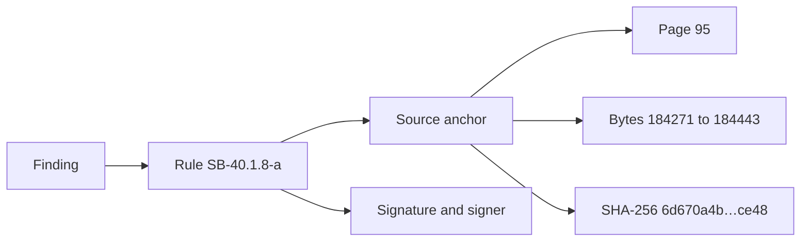

### Verbatim means verbatim

Curly quotes, rupee signs and non standard dashes are preserved exactly as
published.

**1,741 non ASCII characters**, kept rather than normalised, because a clause
hash covers the regulation's own characters and normalising them would silently
change what was signed.

### Footnotes

The circular carries **134 footnote definitions, of which 133 resolve to a
clause.**

Footnotes are where SEBI records which earlier circular a clause came from, so
they are lineage rather than decoration.

---

## Performance

Every figure here comes from `sanhita bench`. Run it and they regenerate. This
run: 13 August 2026, Python 3.14, one laptop.

| Stage | Time | What it did |
|---|---:|---|
| PDF to layout, cold | 1.13 s | 399 pages, 765,120 characters |
| Layout to clause tree, cold | 1.18 s | 2,717 tree nodes |
| Fingerprint the tree, warm | 1.6 ms | hashes every id, span and text |
| **Extract obligations** | **954 ms** | 1,377 obligations, about 1,444 a second |
| Load the signed store | 63 ms | 1,377 rules, 183 certified, 1,560 ledger entries |
| Verify the audit chain | 14 ms | 1,560 hash chained entries |
| Compute coverage | 153 ms | classifies 1,720 clauses |
| Generate a synthetic evidence set | 2.4 ms | 282 events, **synthetic, not a firm's books** |
| Run every certified rule | 2.8 ms | 279 occasions checked, 71 findings |
| Find contradictions | 7.0 ms | 141 pairs compared in full |
| Rank divergence risk | 6.2 ms | 807 clauses scored |
| Measure regulatory load | 1.5 ms | 6 actors, 1,377 rules |

**The evidence row is labelled because the row under it depends on it.**

Those 279 occasions and 71 findings are the engine run against generated
events, which is the only way to time the engine at all when no firm has given
us their books. It is a speed measurement and nothing else. No compliance claim
anywhere in this repository rests on it.

**Cold** means a freshly started process. **Warm** means the clause tree is in
memory, which is what a person working the queue experiences all day.

Timings are medians, and a single run is reported as one observation rather
than dressed up as an average.

Nothing is extrapolated. A stage measured over 1,377 rules is reported over
1,377 rules.

### Deployed

Read off the Fly logs for the rollout of 13 August 2026, 21:36 UTC, one
machine in Mumbai, shared 2 vCPU.

| | |
|---|---:|
| Image pulled and prepared | 12.3 s |
| Machine created and started | 18.5 s |
| Init to the app serving | **6 s** |
| Init to the health check passing | 13 s |

The number that matters to a visitor is the third one: six seconds from a cold
machine to a process that answers, including parsing a 399 page PDF and loading
1,377 rules. The two above it are Fly pulling an image and are outside the
product.

---

## Every screen

| Screen | Question it answers |
|---|---|
| Document | What could the parser read, and what could it not |
| Queue | What still needs a human decision |
| Clause | What does this clause say, and what rule came out of it |
| Coverage | How much of the rulebook is actually operational |
| Gaps | Where is this firm out of compliance, and who signed the rule |
| **Remediation** | **Who is fixing it, by when, and has it closed** |
| Audit | The hash chained history of every decision |
| Operational mapping | Clause to process to team to system to control |
| Contradictions | Where does the circular disagree with itself |
| Divergence | Which clauses will two firms read differently |
| Regulatory load | What does this circular cost a firm per year |
| Forecast | What is about to be missed |
| Impact assessment | What would this amendment do, before publication |
| Amendments | What changed between two editions, what this firm must do about it, and one action plan to approve or decline |
| Check SEBI now | What sebi.gov.in is listing that this installation does not have |
| Company overview | Where this firm stands, and whether a later edition of its rulebook is sitting unread |
| Company evidence | Are the firm's records still arriving, or did they stop in March |
| Supervisor | Every firm on this installation, and what is known about each |
| Facts | Every number we claim, read live |

### The interaction that carries it

On the clause screen, hover any compiled field on the right and the words that
justified it light up in the SEBI text on the left.

If nothing lights up, the field has no textual basis and you should not sign it.

### What the screens refuse to do

No search box. No question box. No chat. No LLM call at evaluation time.

No fabricated number anywhere, and where data is generated rather than real the
screen says so in a warning box, including the seed.

---

## Testing

```bash
pytest                                    # all 990
pytest tests/test_remediation_loop.py     # gap to closed, domain model
pytest tests/test_remediation_web.py      # gap to closed, through the routes
pytest tests/test_real_amendment.py       # the real SEBI amendment
pytest tests/test_change_to_action.py     # that amendment, as work a firm owns
pytest tests/test_amendment_becomes_a_task.py  # and as a task only a fact closes
pytest tests/test_unverified_is_not_a_breach.py # an unknown is not a finding
pytest tests/test_evidence_health.py      # are the records still arriving
pytest tests/test_regulatory_watch.py     # has a later edition arrived unread
pytest tests/test_supervisor_firms.py     # one row per firm, not per document
pytest tests/test_certification_identity.py    # who actually signed this
pytest tests/test_every_action_has_an_actor.py # and every other recorded act
pytest tests/test_signin_keeps_your_work.py    # signing in loses nothing
pytest tests/test_sebi_discovery.py            # check SEBI now, only sebi.gov.in
pytest tests/test_action_plan_approval.py      # the agentic approval boundary
pytest tests/test_what_to_fix_first.py         # priority for a team of two
pytest tests/test_synthetic_market.py          # five firms that do not exist
pytest tests/test_gold_set_readiness.py        # accuracy waits for a human
pytest tests/test_parser_generalises.py   # eleven documents, two formats
pytest tests/test_process_mapping.py      # clause to control chain
pytest tests/test_benchmark.py            # the benchmark measures, not estimates
```

### What the suite defends

| Property | Where |
|---|---|
| The worked example parse never changes | `test_parser_generalises.py` |
| A task cannot be closed by asserting | `test_remediation_loop.py` |
| An unevaluable rule cannot close a task | `test_remediation_loop.py` |
| The UI offers no "mark as fixed" | `test_remediation_web.py` |
| A control binding never enters the signed payload | `test_process_mapping.py` |
| There is no search or question box | `test_web.py` |
| Coverage is not self grading | `test_structure.py` |
| A tampered ledger does not verify | `test_certify.py` |
| A duty with no record is never called a breach | `test_unverified_is_not_a_breach.py` |
| A gold-set ruling never flips toward the machine | `test_finalisation.py` |
| Accuracy stays unpublished until a human rules | `test_gold_set_readiness.py` |

Corpus dependent tests skip themselves when a required PDF is absent. They do
**not** substitute a different document, because a fingerprint mismatch against
the wrong circular reads as a broken parser when the truth is a missing file.

---

## Honest limits

Stated here rather than buried, because a limitation you have to go looking for
is a limitation you are hiding.

**No firm has given us their books.**

A gap report needs a firm's own filing records, and this installation has
whatever has been uploaded to it. There is no fallback to generated events: a
firm with no records is told it has none and offered the upload, rather than
shown a compliance percentage computed from a random number generator.

Generated events still exist for demonstrating the engine, behind an explicit
`?demo=1`, and every screen using them says so.

**The gold set is forty clauses, and every arguable one was ruled against us.**

| Metric | Score | n |
|---|---:|---:|
| Obligation detection, precision | 0.913 | 25 |
| Obligation detection, recall | 0.840 | 25 |
| Obligation detection, F1 | **0.875** | 25 |
| Actor | 95.2% | 21 |
| Modality | 100% | 21 |
| Deadline kind | 100% | 21 |
| Evidence presence | 100% | 21 |
| Denominator classifier | 95.0% | 40 |

The four at 100% are over the clauses both sides agree carry a duty.

Seven of the forty labels were ones where the hand and the machine disagreed.
They were settled by the project's owner rather than by the person who wrote the
extractor, because a gold set signed off by its own author cannot measure
anything.

**All seven were ruled in favour of the human label**, so every one went against
the machine. Had they gone the other way, detection would read 1.000 F1 and
actor 100%. Forty clauses is a small gold set and these figures carry that
uncertainty.

**Conditions hold prose, not predicates.** 931 of them, 94 containing a
comparator and a number. The other 837 are judgement gates, and no solver
reads them.

**Every rule in the shipped store came from the deterministic extractor.** Zero
LLM extractions. The LLM path exists and works and produced none of the 1,377.

**The parser was built on one circular and has since been tested on eleven.**
Seven master circulars and four ordinary ones, 8,871 clause tree nodes between
them, from 2,717 for the stock broker circular down to 5 for a one page timeline
extension. Two real defects surfaced doing that and both are fixed.

**Evidence import reads CSV, JSON, XLSX and PDF.**

A CSV or JSON export that names the requirement becomes evidence directly. A
spreadsheet or a report usually names nothing, so what is found is held as a
candidate for a person to confirm rather than guessed at.

XLSX needs `openpyxl`. Without it the other three still work and the screen
says so.

**One real amendment has been replayed, not twenty.**

The deck said 20+. The true number was zero and is now one: the Investment
Advisers Master Circular of June 2025 against its February 2026 reissue, 57
clauses added, 39 removed, 5 amended and 376 renumbered.

**SEBI discovery is pressed, not polled.**

"Check SEBI now" reads sebi.gov.in's own circulars listing when somebody asks,
and only sebi.gov.in: the host is checked before the request and again after
redirects.

There is no scheduler, no daemon and no background fetch, so this is not
real-time monitoring and the product never calls it that. Nothing discovered
enters the rulebook by being found. It is a title, a date, a link and a hash
for a person to act on.

**The regulatory watch is a separate thing, and it watches this installation.**

It says on every load whether a later edition of a declared rulebook is on file
and has never been compared against the one in use.

**Demonstrations across several firms are synthetic.**

This installation holds one firm. Five firms named "Firm A" to "Firm E" sit
behind an explicit switch, labelled before anything else on the screen, never
written to disk and never counted in a published figure.

**Predicted divergence and observed divergence are different claims.**

The analysis reads a clause and predicts it will be understood two ways, and
that is computed from the real circular. Firms actually recording different
readings is the other half, and the only version of it here is synthetic.

**The key the 183 signatures were made with is lost.**

`/audit/verify` reports 183 checked, 0 valid, on this machine and on the live
site. The rules, their clause hashes and the ledger chain are all intact and
all still verify. What is gone is the separate cryptographic proof that the
signed bytes are unaltered.

Recomputing the signatures under a current key would turn the endpoint green
and would be a different claim, so it has not been done. The Facts page says
this on screen rather than leaving a reviewer to find it.

**A signature covers the rule's content, not the officer's identity.**

One HMAC key belongs to the deployment rather than to each officer, so it
proves the rule has not changed since it was signed and proves nothing
cryptographic about who signed it.

Certifying, rejecting and amending now require an account and record that
account, rather than accepting a name typed into a box. But a per-officer key
is a real change to the trust model and is not claimed.

**A duty with no record is unknown, and never a breach.**

The engine emits four outcomes and only two of them are findings against the
firm: `MISSING` and `LATE`, which the firm's own records prove.

`NO_EVIDENCE` means the duty fell due and there is no record either way, which
is very often one discharged perfectly on paper that nobody uploaded.

It is counted and shown separately as **not verifiable**, on the assessment
screen and on the overview. The control on such a row asks for the evidence
rather than offering to fix a breach.

This used to be folded into one number, so a firm with one uploaded register
was told it had 30 breaches when 29 were unknowns.

---

## Repository layout

```
src/sanhita/
├── parse/           PDF to clause tree
│   ├── layout.py        lines, footnotes, page furniture, measured body size
│   ├── clause_tree.py   numbering, depth, flat fallback, spans and hashes
│   ├── footnotes.py     lineage, 133 of 134 resolved
│   └── quality.py       Readable, With care, or No
├── ir/              the typed artifact
│   ├── schema.py        Obligation and every value object
│   ├── canonical.py     byte stable JSON, the signing payload
│   └── enums.py         Actor, Modality, DeadlineKind, DayCount
├── compile/         extraction
│   ├── extract.py       deterministic, no network
│   ├── llm.py           model assisted, span verified
│   └── temporal.py      deadlines, periods, day counts
├── certify/         the human boundary
│   ├── lifecycle.py     versions, status, point in time replay
│   └── ledger.py        append only, hash chained
├── execute/         deterministic run
│   ├── applicability.py was anything owed, before evidence is read
│   ├── engine.py        due dates, outcomes, refusals
│   ├── evidence.py      the firm's records
│   └── report.py        findings with citations
├── remediate/       closing the gap
│   ├── tasks.py         the task, its lifecycle, its log
│   └── service.py       where a task meets the engine
├── diff/            amendments
├── analyse/         conflicts, divergence, burden, forecast, impact
├── metrics/         coverage and its denominator
├── controls.py      process, team, system, procedure
├── benchmark.py     every performance figure in this file
├── eval/            the forty clause gold set and the scoring harness
└── web/             FastAPI, Jinja, vanilla JS

corpus/              SEBI circulars: the stock broker one and both IA editions
.sanhita/            compiled store, signatures, ledgers
GOLD-SET-RULINGS.yaml  the seven gold-set rulings, signed off
tests/               990 tests
```

The gold set is a package under `src/`, not a top level folder. A top level
`eval/` exists and holds output only, which is why it is gitignored: a
committed copy is a stale copy waiting to contradict a live run.

---

## Deployment

A single container. `Dockerfile` and `fly.toml` are in the repository.

```bash
fly launch --no-deploy --copy-config
fly secrets set SANHITA_SIGNING_KEY=<32 random hex characters>
fly deploy
```

The GitHub Actions workflow runs the full suite, deploys, then verifies the
**live** instance still reproduces the parse fingerprint the signatures were
made over.

A green build is not evidence the site works, so the pipeline checks the
running thing.

### Stack

Python 3.11 or newer, Pydantic v2, PyMuPDF pinned to 1.27.2.2, Typer, FastAPI,
Jinja2, uvicorn, pytest.

Developed on 3.14. CI runs the suite on 3.11, 3.12 and 3.13, and the container
builds on 3.12.

Server rendered HTML and hand written CSS. **No React, no build step, no npm,
no CDN.**

Every screen renders in a room with no network, which is a requirement rather
than an aesthetic, and a test walks the pages asserting no stylesheet, script,
font or image is loaded from another host. The single exception is the "Check
SEBI now" button, which is a person deliberately asking to go out.

---

## Where every number came from

A regulator's first question about a compliance tool is where its numbers come
from.

Every figure in this file regenerates from one command against the committed
corpus and the committed store. Nothing is typed in by hand and nothing is
carried forward from an older run.

| Claim | Regenerate it with |
|---|---|
| 399 pages, 765,120 characters, 2,717 tree nodes | `sanhita bench` |
| 1,720 parsed, 1,070 duty bearing, 650 excluded and why | `sanhita coverage --explain` |
| 75.4% compiled, 11.8% certified, 91.8% evidence mapped | `sanhita coverage --explain` |
| 1,377 rules, 183 certified, 1,560 ledger entries | `sanhita bench`, or `/healthz` on the live site |
| 13 findings: 11 duplications, 1 deadline, 1 modality | `sanhita conflicts` |
| 8,291 events a year, 725 duties, 528 clauses, 0.4% coupling | `sanhita structure` |
| 0.875 F1, 95.2% actor, 95.0% denominator, 40 clauses | `sanhita eval` |
| 376 renumbered, 57 added, 39 removed, 5 modified | `sanhita diff` on the two IA editions |
| 25 signatures lost, 82 actions, 0 re-certifications | `pytest tests/test_change_to_action.py` |
| 30 findings, all unknowns, 0 breaches | `pytest tests/test_unverified_is_not_a_breach.py` |
| Tree fingerprint `3a0a41f5…` | `sanhita verify`, and the deploy pipeline |
| 990 tests | `pytest` |

### What the audit of 14 August 2026 found

This file was checked against those commands, and it did not come through
clean. Three figures had drifted from what the code produces.

| Was | Is |
|---|---|
| Conditions with a comparator, "about 5%" | **10.1%**, 94 of 931 |
| "18 clauses carry two or more signals" | **18 score 4 or higher**; 117 carry two or more |
| 11,262 clauses across eleven documents | **8,871** |

Two illustrations wore real clause numbers over invented figures, and both were
replaced with real runs. Every correction moved toward what the code does,
never toward the claim.

That is worth stating rather than quietly fixing. A tool whose whole argument
is that an answer must be traceable does not get to hold its own README to a
lower standard.

Anything here the corpus will not support is a defect in this file, and the
commands above are how you find out.

### Two pairs this project refuses to merge

**Breaches and unknowns.**

A duty with no record is not a breach. It is usually one discharged perfectly
on paper that nobody uploaded, and calling it a finding teaches a firm to
ignore findings. `GapReport.breaches` counts `MISSING` and `LATE` only.

**Duplications and contradictions.**

Eleven of the thirteen conflict findings are the same duty printed twice by
consolidation. Two are genuine disagreements. Adding them and saying *thirteen
contradictions* overstates the real number six fold.

Neither pair is ever added together, on any screen or in any figure here.
