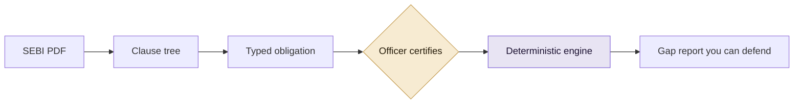

# Sanhita

**A regulation compiler for India's securities markets.**

Built for the SEBI Securities Market TechSprint 2026, Problem Statement 2,
*Agentic Compliance, From Regulatory Text to Operational Action*.

Live at **https://sanhita.fly.dev**

---

## What it does

SEBI publishes regulation as prose in a PDF. Every broker in the country reads
that PDF, decides what it means, and writes the answer into a spreadsheet.

Sanhita compiles it instead, into typed rules that a machine can run, a named
human has signed, and an inspector can trace back to an exact clause and its
SHA-256 hash.

> Probabilistic in the loop. Deterministic at the core. Human certified at the boundary.

A language model proposes a rule once. A compliance officer signs it once. From
then on the rule runs as pure logic, so the same evidence always produces the
same answer. No model runs at evaluation time. There is no chatbot and no
search box.



---

## What is in here

Measured on the SEBI Master Circular for Stock Brokers, 17 June 2025.

| | |
|---|---:|
| Pages | 399 |
| Clauses parsed | 1,720 |
| Clauses carrying a duty | 1,070 |
| Obligations compiled | 1,377 |
| Certified and signed by a named officer | 183 |
| Time to compile the whole circular | 954 ms |
| Cost to compile it | $0.00 |
| Tests | 990 |

Accuracy against a hand labelled gold set of 40 clauses: **0.875 F1** for
obligation detection, 95.2% actor, 100% modality, 95.0% denominator classifier.

A real SEBI amendment has been carried end to end. The Investment Advisers
Master Circular of June 2025 against its February 2026 reissue renumbered 376
clauses and broke 25 signatures, producing 82 pieces of work a named person
owns. The tool closed none of them by itself.

---

## Running it

```bash
pip install -e ".[dev,web]"
export SANHITA_SIGNING_KEY=$(python -c "import secrets; print(secrets.token_hex(32))")
sanhita serve
```

Open `http://127.0.0.1:8000`. The circular is committed to the repository,
already parsed and compiled, so a clean clone has something real to look at.

Other commands:

```bash
sanhita coverage --explain   # coverage with its full denominator
sanhita conflicts            # where the circular disagrees with itself
sanhita structure            # what this circular costs a firm per year
sanhita eval                 # score extraction against the gold set
sanhita diff <before> <after>  # compare two editions
sanhita bench                # time every stage of the pipeline
```

With Docker:

```bash
docker build -t sanhita .
docker run -p 8000:8000 -e SANHITA_SIGNING_KEY=$(openssl rand -hex 32) sanhita
```

---

## Layout

```
src/sanhita/
  parse/       PDF to clause tree
  ir/          the typed obligation, and its byte stable signing payload
  compile/     extraction
  certify/     signatures and the hash chained audit ledger
  execute/     deterministic run against the firm's evidence
  remediate/   closing the gap
  diff/        amendments
  analyse/     conflicts, divergence, load, forecast, impact
  eval/        the gold set and the scoring harness
  web/         FastAPI, Jinja, vanilla JS

corpus/        SEBI circulars
.sanhita/      compiled store, signatures, ledgers
tests/         990 tests
```

Python 3.11 or newer, Pydantic v2, PyMuPDF pinned to 1.27.2.2, FastAPI, Jinja2,
pytest. Server rendered HTML and hand written CSS. No React, no build step, no
npm, no CDN. It runs offline.
