# Sanhita

**A regulation compiler for India's securities markets.**

> Probabilistic in the loop. Deterministic at the core. Human certified at the boundary.

Built for the **SEBI Securities Market TechSprint 2026**, Problem Statement 2,
*Agentic Compliance: From Regulatory Text to Operational Action*.

**Live at [sanhita.fly.dev](https://sanhita.fly.dev)**

*Sanhita*, from Sanskrit, means a systematically compiled body of law.

---

## Contents

**Understanding the idea**

1. [The one thing worth understanding](#1-the-one-thing-worth-understanding)
2. [The problem, in SEBI's own words](#2-the-problem-in-sebis-own-words)
3. [Why this is not a chatbot](#3-why-this-is-not-a-chatbot)
4. [The architecture](#4-the-architecture)

**How it works, stage by stage**

5. [Stage one: reading the PDF](#5-stage-one-reading-the-pdf)
6. [Stage two: building the clause tree](#6-stage-two-building-the-clause-tree)
7. [Stage three: the Obligation IR](#7-stage-three-the-obligation-ir)
8. [Stage four: extraction](#8-stage-four-extraction)
9. [Stage five: human certification](#9-stage-five-human-certification)
10. [Stage six: deterministic execution](#10-stage-six-deterministic-execution)
11. [Stage seven: the remediation loop](#11-stage-seven-the-remediation-loop)

**What the typed rules make possible**

12. [Operational mapping](#12-operational-mapping)
13. [Amendments, the hardest problem](#13-amendments-the-hardest-problem)
14. [Impact assessment before publication](#14-impact-assessment-before-publication)
15. [Cross rule analysis](#15-cross-rule-analysis)
16. [Coverage and its denominator](#16-coverage-and-its-denominator)

**How you check us**

17. [Determinism](#17-determinism)
18. [Provenance](#18-provenance)
19. [Accuracy, measured against a human](#19-accuracy-measured-against-a-human)
20. [Performance](#20-performance)
21. [Every screen and what it answers](#21-every-screen-and-what-it-answers)
22. [Honest limits](#22-honest-limits)
23. [How Problem Statement 2 is answered](#23-how-problem-statement-2-is-answered)

---

## 1. The one thing worth understanding

Most compliance tools answer questions. Sanhita refuses to.

That refusal is the entire product, so it is worth being precise about why.

An answer you cannot audit is not compliance. A regulator knows this
instinctively. If a firm tells an inspector *the system said we were compliant*,
the only useful follow up is *show me why*, and a system that cannot answer that
second question has not helped anybody.

So Sanhita never lets a model decide anything:

- A language model **proposes** a rule, exactly once, when a clause is first read.
- A named compliance officer **certifies** that rule, exactly once, and signs it.
- From that moment the rule runs as **pure logic**, forever.

The same evidence always produces the same answer. Not usually. Always.

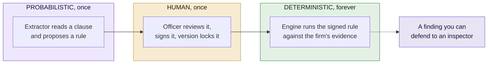

### What this buys you

| Property | Why it matters to a regulator |
|---|---|
| **Reproducible** | The same evidence gives the same verdict on any machine, on any day, forever |
| **Traceable** | Every finding names a clause, a page, a byte range and a SHA-256 hash |
| **Attributable** | Every signed rule names the officer who signed it and when |
| **Tamper evident** | Every decision sits on a hash chained ledger that breaks visibly if edited |
| **Auditable offline** | No network call is made while a rule is being evaluated |
| **Cheap to re-run** | Re-checking the whole rulebook against a firm's records takes milliseconds |

### The one number that captures it

**Zero.** That is how many language model calls happen when a compliance
question is actually answered. The model does its work months earlier, once, and
a human signs off before anything it produced is ever used.

---

## 2. The problem, in SEBI's own words

Problem Statement 2 names two challenges and one root cause.

### Challenge one: dynamic regulatory translation

> Interpreting a new or amended requirement, mapping it to the affected
> intermediary's operational processes, and updating compliance workflows in a
> timely and consistent manner.

### Challenge two: ongoing compliance management

> Tracking existing obligations, mapping each to evidence of fulfilment,
> maintaining audit trails, and identifying and remediating compliance gaps
> before they become regulatory findings.

### And the root cause, quoted exactly

> The regulatory framework exists as unstructured, human-readable text, while
> operational compliance systems require structured, machine-actionable rules.
> Bridging this gap, transforming regulatory intent into programmable, auditable
> compliance logic, is the core unsolved problem.

### What that looks like in practice today

Consider one clause from the SEBI Master Circular for Stock Brokers:

> **40.1.8.** As like in derivatives segments, the TMs/CMs shall report to the
> Stock Exchange on T+5 day the actual short-collection/ non-collection of all
> margins from clients.

Every stock broker in India reads that sentence. Each one has to decide:

- **Who** is bound? Trading members, clearing members, or both?
- **What** exactly must be produced? A report, a filing, a register?
- **To whom?** Which exchange, and through which channel?
- **By when?** T+5, but does T+5 count working days or calendar days? *The
  clause does not say.*
- **How often?** Once, or every time a short collection occurs?
- **What proves it happened**, if an inspector asks two years later?

Multiply that by **1,070 duty bearing clauses** in a single circular. Then
multiply by every circular SEBI issues. Then remember that SEBI reissues master
circulars annually, and clause numbers move when it does.

That is the problem. It is not that the text is hard to read. It is that the
text has to be turned into something a computer can run and a human can defend,
and today that translation lives in a spreadsheet in somebody's head.

---

## 3. Why this is not a chatbot

This deserves its own section because it is the design decision everything else
follows from, and because the obvious thing to build here is a chatbot.

### What a chatbot would do

You would upload the circular. You would ask *am I compliant with margin
reporting?* It would give you a fluent, confident, well formatted answer.

### Why that fails

- **It gives a different answer next Tuesday.** Same question, same documents,
  different words. There is no version of that a firm can build a control on.
- **It cannot show its work.** You get a paragraph, not a clause reference with
  a hash you can verify against the published PDF.
- **Nobody signed it.** When an inspector asks who decided that T+5 meant
  working days, there is no name.
- **It fails silently.** A model that misreads a clause produces the same
  confident tone as one that reads it correctly.
- **It cannot be re-run.** You cannot take last quarter's answer and prove it
  would still hold today.

### What Sanhita does instead

It moves the model to the **front** of the pipeline, where it drafts something a
person then signs, and keeps it out of everything downstream.

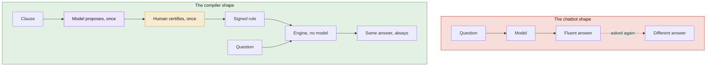

### This is enforced, not merely promised

**Three tests fail the build** if anyone adds a search box, a question box or a
chat surface. They do not look for the word "chat". They inspect the rendered
HTML of every screen and assert:

- No `<input type="search">` anywhere
- No input or textarea named `q`, `query`, `question`, `search`, `ask`,
  `prompt`, `message` or `chat`
- Every `GET` form contains only selects and checkboxes, never free text, because
  a `GET` form that accepts free text and returns a response **is** a query box
- Every `POST` form targets a named lifecycle action: certify, reject, resolve,
  edit or bind

The test was written that way because the circular itself contains headings like
"Frequently Asked Questions", and a naive substring search flagged the
regulation as a chatbot.

---

## 4. The architecture

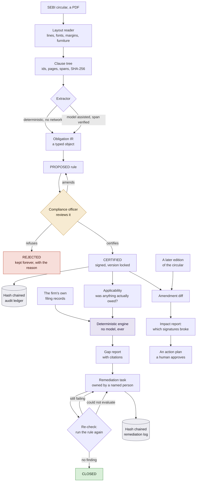

### Four separate stores, and the separation is deliberate

| Store | What it holds | Whose fact is it |
|---|---|---|
| `rules.json` | The compiled rulebook, the signatures, the audit ledger | **The regulator's text.** Shared by everyone |
| `evidence.json` | What the firm filed, and when | **The firm's records.** Private to that firm |
| `controls.json` | Process, team, system, written procedure | **How the firm is organised.** Private |
| `remediation.json` | Tasks and their hash chained log | **What the firm did about a finding** |

Why this matters: recording that "margin reporting is owned by the Operations
team" must never alter the bytes a signature covers. A firm reorganises its
teams every year. If that invalidated **183 certifications**, nobody would ever
record their org structure.

A test asserts that adding a full control chain leaves the obligation's
canonical JSON **byte for byte identical**.

---

## 5. Stage one: reading the PDF

A circular is not a text file.

It is a laid out document with running headers, footnote rules, page numbers,
tables and two columns of margin notes. Every one of those is noise that ends up
**inside a clause** if the reader is naive, and a clause with a page number
glued onto it hashes differently from the clause SEBI published.

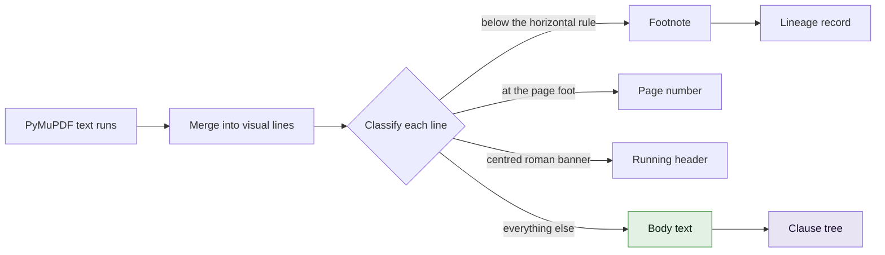

### Body text is measured, not assumed

This is where a real bug was found, and the fix is instructive.

The first version declared body copy to be 12pt, because that is what the stock
broker circular uses. Reasonable, and wrong.

SEBI typeset the June 2025 research analyst circular at **11.3pt**. Every line
in it fell under the threshold. Every line was classified as furniture. A
document containing **139 well formed numbered clauses parsed to nothing**, and
reported "no numbered clauses were found".

The threshold is now the **modal font size of the document itself**, less a
tolerance of 0.7.

That tolerance is not arbitrary:

- A 12pt document lands at 11.3
- Which admits and excludes **exactly** what the old fixed 11.5 did
- So the stock broker tree is unchanged
- So its **183 signatures stay valid**
- And a test fails if anybody widens it

### Section margins are measured too

`_SECTION_MAX_X0` was a fixed 115 points. Every circular tested happened to sit
under that, which was luck rather than design.

It is now the fifth percentile of the document's own indents plus a band,
combined with the old constant so the result can only ever be **more**
permissive. A heading that qualified before still qualifies, which is what keeps
the existing tree stable.

Measuring found a live bug: the investment adviser circulars have wider margins,
and the fixed ceiling was cutting off a real section heading in each.

### The lesson

Both defects were the same mistake. A constant measured from one document was
written into the source as though it described all documents.

A compliance officer does not upload the one circular the parser was tuned
against. They upload whatever the regulator sent them.

---

## 6. Stage two: building the clause tree

**Clause numbering is authoritative. Indentation is corroborating.**

Depth comes from the number of dotted components. Where the document's own
indentation disagrees with the numbering, the clause is **flagged** rather than
silently re-parented, because silently re-parenting is how a subclause quietly
becomes a top level duty.

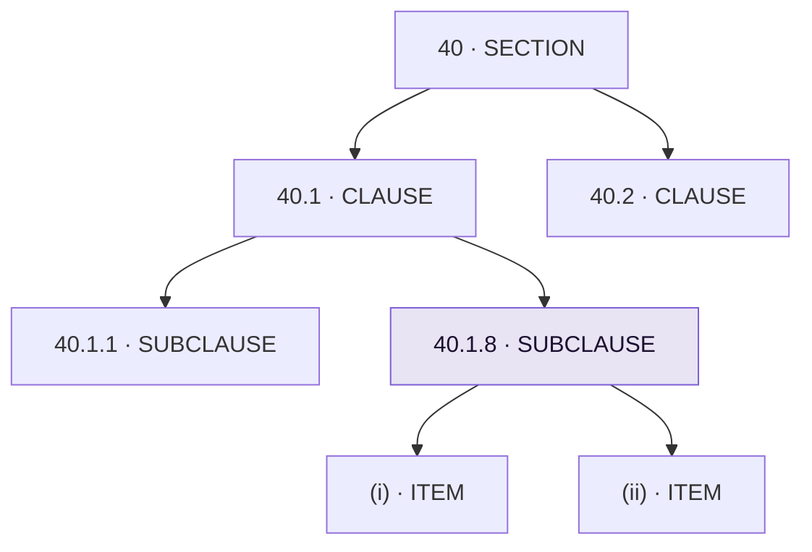

### What every node carries

| Field | Example | Why it exists |
|---|---|---|
| `id` | `40.1.8` | The clause's own number, as SEBI wrote it |
| `page` | `95` | So a reader can open the PDF and look |
| `char_span` | `(184271, 184443)` | The exact bytes in the extracted document text |
| `sha256` | `6d670a4b…ce48` | A hash of the clause's own characters |
| `kind` | `SUBCLAUSE` | Section, clause, subclause, item, annexure, appendix |
| `section` | `40` | Which part of the circular it belongs to |

Those together are what lets a compiled rule say, two years later:

> *I came from clause 40.1.8, on page 95, at bytes 184271 to 184443, and here is
> the SHA-256 hash of the exact words I read.*

### The shape of the corpus

The stock broker circular parses to **2,717 tree nodes**:

| Kind | Count |
|---|---:|
| Clause | 1,058 |
| Subclause | 1,049 |
| Item | 479 |
| Section | 98 |
| Annexure | 32 |
| Appendix | 1 |
| **Total** | **2,717** |

Of these, **1,720 make up the main body**. The other 997 are 996 annexure nodes
and one appendix, and they are excluded from the coverage denominator so that a
form reproduced at the back of the circular cannot inflate a percentage.

Both numbers are reported honestly, in different places, for different purposes.

### Flat circulars, the documents that actually cause the problem

A master circular is an annual consolidation with bold numbered headings.

An **ordinary** circular is one or two pages, has no headings at all, and its
body is five numbered paragraphs.

The tree builder only recognised the first shape, so short circulars parsed to
nothing. Those are precisely the documents that arrive weekly and create the
translation problem in the first place. Dropping them dropped the wrong half.

`_parse_flat` handles them, and it runs **only when the structured pass found no
numbered node at all**, which is what keeps it from ever touching a document
that parsed normally.

Two rules, deliberately strict, because it runs on documents the main parser
could make no sense of:

- A clause opens at the document's **own measured left margin**, not a guessed one
- Numbers may not go backwards, so a `1.` after a `5.` is a restarted list inside
  a paragraph, not a sixth clause

---

## 7. Stage three: the Obligation IR

This is the heart of the product. A clause stops being a paragraph and becomes a
**typed object**.

Here is `SB-40.1.8-a` exactly as it sits in the shipped store. Not a sketch of
one, the real thing:

```python
Obligation(
    id="SB-40.1.8-a",
    actor=Actor.STOCK_BROKER,
    modality=Modality.MUST,
    action=Action(verb="report",
                  object="the actual short-collection/ non- collection of all "
                         "margins from clients",
                  recipient="Stock Exchange"),
    trigger=Trigger(kind=TriggerKind.CONTINUOUS, expression="always"),
    deadline=Deadline(kind=DeadlineKind.RELATIVE, offset_days=5,
                      anchor_event="trade.date",
                      business_days=DayCount.UNSPECIFIED),
    conditions=[],
    evidence=[EvidenceReq(artifact_type="REPORT_FILING",
                          producible_on_demand=True)],
    source=SourceAnchor(circular_id="SEBI/HO/MIRSD/MIRSD-PoD/P/CIR/2025/90",
                        clause_id="40.1.8", section="40", page=95,
                        char_span=(184271, 184443),
                        sha256="6d670a4b10d4b7df67fe421727214513"
                               "586bc6b586b6394bea2684a78deece48"),
    confidence=0.803,
    status=RuleStatus.PROPOSED,
)
```

Notice `business_days=DayCount.UNSPECIFIED`. SEBI wrote *T+5 day* and did not
say which kind of days. **That single field is why this rule is still
`PROPOSED`** and cannot be signed until a person decides.

### Three structural commitments

#### Deadline and Commencement are different fields

A clause saying a requirement **applies from** 1 April is not a clause saying you
**have until** 1 April.

Collapsing both into one date field is the single most common way a compliance
spreadsheet becomes wrong, and the type system refuses to allow it.

#### Day count is tri-state, not a boolean

`BUSINESS`, `CALENDAR`, `UNSPECIFIED`.

- SEBI often writes *within 30 days* without saying which
- The two readings give **different due dates**
- Silently applying the market convention would bake an invisible interpretation
  into a signed artifact
- That is precisely what this product exists to eliminate

So `UNSPECIFIED` **blocks certification**. The workbench shows the blocking issue
and offers a resolution form instead of the certify button. A named officer makes
the call, and their answer is recorded as **theirs**.

#### Every field carries its own provenance

`field_provenance` maps each field to the character span that justified it:

```
action.object      (99, 171)   "the actual short-collection/ non- collection of all margins from clients"
action.recipient   (73, 87)    "Stock Exchange"
action.verb        (59, 65)    "report"
actor              (45, 52)    "TMs/CMs"
deadline           (91, 98)    "T+5 day"
modality           (53, 58)    "shall"
```

This powers the central interaction in the workbench: hover any compiled field
and the words that justified it light up in the SEBI text beside it.

**If nothing lights up, the field has no textual basis and you should not sign
it.**

### Conditions hold prose, not predicates

This is a limitation, stated plainly, because the alternative is worse.

- **931 conditions** across the corpus
- **94 of them, or 10.1%**, contain so much as a comparator and a number
- The other **837** are judgement gates of the form *where the circumstances so
  warrant*

That 10.1% is measured with the product's own `_NUMERIC_CONDITION` pattern, the
same test the divergence screen uses to decide whether a condition is a
judgement, so the published figure and the screen cannot drift apart.

**What this bounds.** A condition in prose is enough to show a reviewer why a
rule might not apply to them. It is **not** enough to prove a rulebook
consistent, to detect a fact pattern no rule covers, or to feed a constraint
solver.

**Why we did not just use a model to convert them.** That would put a
probabilistic step inside a result presented as a proof, which is the one thing
this product exists to refuse. The intended route is the same one the day count
takes: the extractor records what the clause says, and a named person supplies
the formal predicate at certification time.

---

## 8. Stage four: extraction

Two engines sit behind one interface.

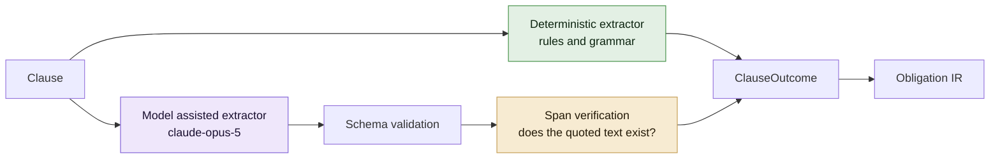

| | Deterministic | Model assisted |
|---|---|---|
| Whole circular | **954 ms** | roughly 40 hours |
| Cost | **$0.00** | real money |
| Network | none | an API call per clause |
| Reproducible | **bit for bit** | pinned model and prompt |
| Rules in the shipped store | **1,377** | **0** |

### Every rule in the shipped store came from the deterministic extractor

The model path exists, works, and produced **none** of them.

Run live against clause 40.1.8, the model found **two** obligations where the
rules engine found one. It correctly noticed the clause binds both a trading
member and a clearing member, and it left the day count unresolved rather than
assuming a convention.

It took **105 seconds** for that one clause.

So the model is reserved for text the rules cannot reach, rather than run over
everything. This is a deliberate position, not a shortcut:

- **1,377 rules in 954 milliseconds, at zero cost**, is not a worse outcome than
  paying for 40 hours of inference
- Every one of them is byte for byte reproducible
- A reviewer certifying a rule wants to check the rule against the clause, and
  that is the same job whichever engine drafted it

### Extraction never silently returns nothing

A clause always produces **exactly one** `ClauseOutcome`, carrying either
obligations or the explicit reason there are none.

Returning an empty list is how a parser quietly loses half a document.

---

## 9. Stage five: human certification

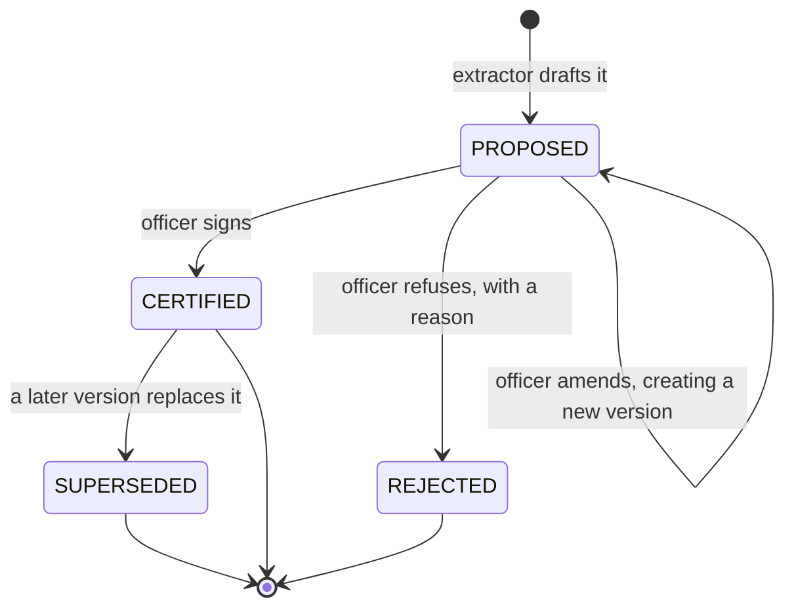

### What a signature actually is

Certification is **HMAC-SHA256 over the obligation's canonical bytes**.

The canonical form is byte stable, which means:

- Key ordering does not change the signature input
- Float formatting does not change the signature input
- The same obligation always produces the same bytes to sign

Without that property, a signature would break when the JSON library changed its
mind about spacing, and every one of them would have to be redone.

### Certification is refused where a field is unresolved

An officer **cannot** sign a rule whose day count is `UNSPECIFIED`, or whose
deadline the clause did not settle.

This is enforced by the type system and the route handler, not by a warning
message. The workbench replaces the certify button with a resolution form.

### The audit ledger

Append only. Hash chained. Every entry carries the hash of the one before it.

```
  rules tracked                       1377
  ledger entries                      1560
  ledger head                         1007092cf7b2057c1ff6037c600888e7

  RECENT TRANSITIONS
    [1558] 2026-08-04T23:37:12Z  SB-62.8-a  PROPOSED -> CERTIFIED  by Sanhita Demo Officer
    [1559] 2026-08-04T23:37:12Z  SB-62.9-a  PROPOSED -> CERTIFIED  by Sanhita Demo Officer
```

If an entry is altered, the chain stops verifying at that point and the screen
says **which entry** and **why**. A test tampers with a ledger and asserts it
fails to verify.

### Every state changing action requires an account

Reading is never gated. Anyone can browse the whole rulebook without signing in.

But certifying, rejecting and amending all require an account, and all record
which account did it. A single function, `_acting_officer()`, is the one gate,
so there is no second path that forgets to check.

This replaced an earlier design where the officer's name was typed into a text
box, which meant anybody could type any name.

---

## 10. Stage six: deterministic execution

Certified rules run against the firm's own evidence. **No model is consulted at
this point**, so the same evidence always produces the same answer.

### Applicability, and why silence is not innocence

The engine used to skip any rule with no evidence, reasoning that no evidence is
not a breach.

That is true of a rule which **never fell due**. It is false of one which fell
due twelve times and produced nothing. The two were indistinguishable, which
meant a firm that had filed nothing at all looked perfectly clean.

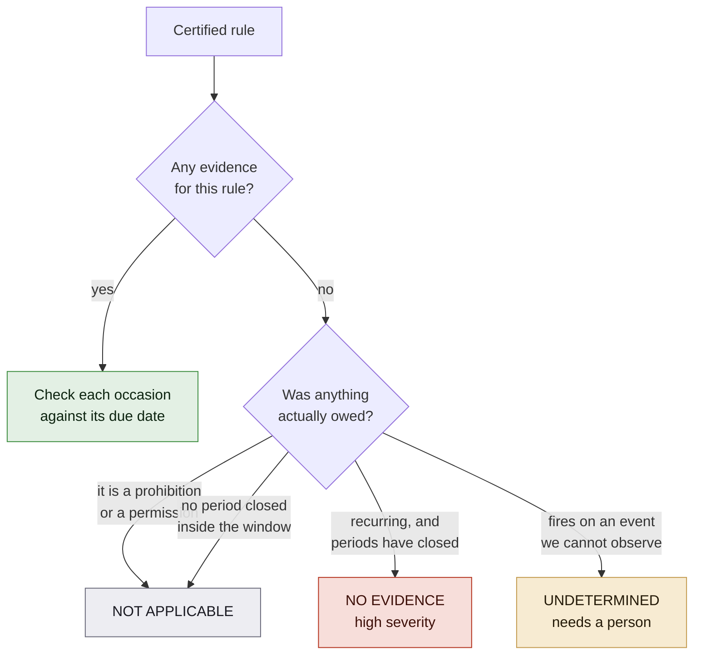

Run the real rulebook against a firm that has filed nothing and you now get:

| Outcome | Count |
|---|---:|
| Findings | **30** |
| Not applicable | 15 |
| Undetermined | 138 |
| **Breaches** | **0** |

Before this change, all of it was zero.

`UNDETERMINED` is never counted as a pass. **A tool that looks safer the less it
understands is worse than no tool.**

### The four outcomes

| Outcome | Meaning | Is it a finding against the firm? |
|---|---|---|
| `SATISFIED` | The artifact was produced on or before the due date | No |
| `LATE` | Produced, but after the due date | **Yes** |
| `MISSING` | An occasion is recorded and its artifact never arrived | **Yes** |
| `NO_EVIDENCE` | The duty fell due and there is no record of it at all | **No** |

### The distinction that matters most

`MISSING` and `NO_EVIDENCE` are kept apart deliberately, and this is the single
most important semantic decision in the engine.

- **`MISSING`** is a process that ran and failed. The firm's own records prove
  it. That is a breach.
- **`NO_EVIDENCE`** is a duty that fell due with no record either way. It is
  **very often a duty discharged perfectly on paper that nobody uploaded.**

Calling the second one a breach teaches a firm to ignore findings.

So `GapReport.breaches` counts `MISSING` and `LATE` only. `NO_EVIDENCE` is
counted separately as **not verifiable**, shown separately on every screen, and
the control on such a row asks for the evidence rather than offering to fix a
breach.

This used to be folded into one number. A firm with one uploaded register was
told it had **30 breaches** when 29 of them were unknowns.

### Unevaluable is not a pass

A rule the engine cannot check is listed as unevaluable **with the reason**,
never counted as satisfied.

Silence there is how compliance tools come to report reassuring numbers that
mean nothing.

---

## 11. Stage seven: the remediation loop

Finding a gap is a report. Closing one is work somebody owns.

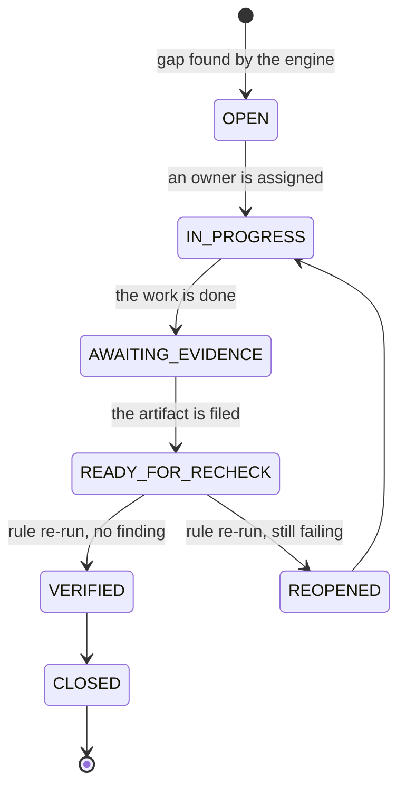

### Nothing closes because a person says it is fixed

`RemediationStore.set_status` **physically refuses** to accept `VERIFIED` or
`CLOSED`.

The only path to either is `recheck`, which runs the certified rule again through
the **same engine** that raised the finding.

| The engine returns | What happens |
|---|---|
| No finding for this rule | **VERIFIED, then CLOSED** |
| Still a breach | **REOPENED**, back to the owner |
| Declined to evaluate the rule | **Nothing**, and the reason is logged |

**That third row is the interesting one.** A rule the engine will not evaluate
produces no findings, and treating that as a pass would let anybody close a task
by making the rule uncheckable.

The service checks `rules_evaluated` before concluding anything, and a test
asserts that closure cannot be obtained that way.

### There is no "mark as fixed" button

A test asserts the UI does not offer one. It inspects the rendered HTML.

### Every transition is logged

On an append only hash chained log, separate from the certification ledger,
because remediation is a different kind of fact:

```
CREATED -> ASSIGNED -> EVIDENCE_ATTACHED -> RECHECKED -> VERIFIED -> CLOSED
```

---

## 12. Operational mapping

Problem Statement 2 asks for a requirement mapped to the affected intermediary's
**operational processes**.

Knowing that a rule binds *a stock broker* names a category of firm, not a part
of one. Nobody can be handed that.

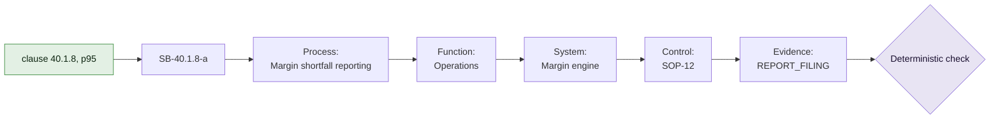

The clause, the obligation id and the evidence type are the real ones. The
process, function, system and control are what a firm records about itself, so
they are that firm's own words and Sanhita never invents them.

| Term | Answers the question |
|---|---|
| **Function** | *Who* is responsible |
| **System** | *Where* the evidence is produced |
| **Control** | The *written procedure* that governs it |
| **Process** | The *part of the business* the duty attaches to |

### Bound and mapped are counted separately

A rule bound to "Operations" and nothing else has an owner, but it does not tell
anybody what to go and fix. Counting those together would overstate how
operational the rulebook actually is.

### Systems are counted, and that is a risk signal

A system carrying many duties is a **single point of failure the firm may not
have noticed**. If its export format changes, every duty above it loses its
evidence at once.

### Bindings never touch the signed bytes

They live in `controls.json`. A test asserts that adding a full chain leaves the
obligation's canonical JSON byte identical.

---

## 13. Amendments, the hardest problem

This is the part of Problem Statement 2 that nothing on the market handles well,
and it is where Sanhita has the strongest evidence.

SEBI issued a Master Circular for Investment Advisers in **June 2025** and
reissued it in **February 2026**. Both PDFs are in the repository. This is a
genuine amendment, not an edit applied by hand to make a demo work.

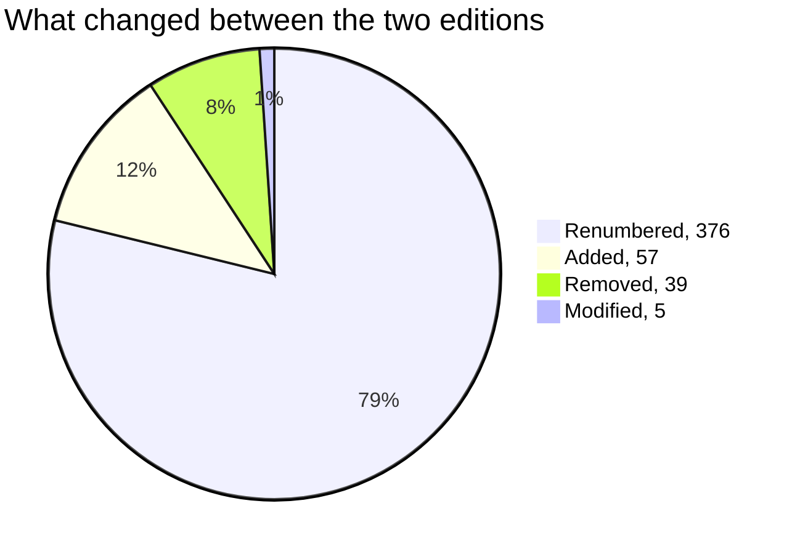

| Change | Clauses |
|---|---:|
| **Renumbered** | **376** |
| Added | 57 |
| Removed | 39 |
| Modified | 5 |
| Unchanged, keeping their number | **0** |

### The renumbering is the finding

376 clauses moved.

A compliance process built on a spreadsheet of clause references survives that
**worst of all**, because it does not survive at all and nobody notices:

- Every row still points at a clause number
- Every one of those numbers still exists in the new edition
- Each one now means **something different**
- Nothing manual detects this, because nothing looks broken

A firm using that spreadsheet would keep filing against the wrong obligations
for a year.

### What it cost, and two honest answers

Ask the **shipped rulebook** what this amendment cost and the answer is
**zero signatures lost**.

That is correct rather than evasive. The 183 signatures are over the stock
broker circular, and no investment adviser rule has been certified here. The
report says zero instead of inventing an effect.

**So the demonstration signs the June edition first, and asks again.**

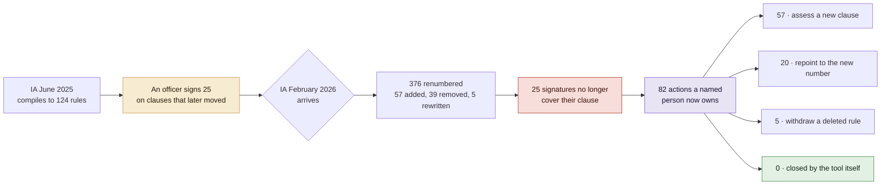

| | |
|---|---:|
| Rules compiled from the June edition | 124 |
| Rules signed on clauses this amendment moved | 25 |
| Signatures no longer covering their clause | **25** |
| Certified rules that came through untouched | 0 |
| Actions the firm now owns | **82** |
| Re-certifications the tool performed by itself | **0** |

### That last row is the product, not a shortcoming

A tool that re-certified those 25 rules for you would be faster and would be
**worthless**. The signature is the whole point, and only a person can put one
there.

### Each kind of amendment work closes on a different fact

An evidence task closes when the rule is run again and finds no breach. An
amendment task has no records to run against, so each kind closes on its own
verifiable fact:

| Action | Closes when |
|---|---|
| `RECERTIFY` | A certification exists over the clause's **new** characters |
| `REPOINT` | The rule's anchor is the new number, and it is signed over it |
| `WITHDRAW` | The rule is no longer live in the store |
| `REREAD` | A person signed the rule again after the task was raised |
| `ASSESS_NEW` | A rule from the new clause reached certified or rejected |

**None of them can be asserted.** There is still no button that marks a task done.

---

## 14. Impact assessment before publication

The same machinery runs **forward**. Change a certified rule's deadline and the
consequences are computed before anything is published.

This is aimed at the regulator rather than the firm, and it is a real run against
the shipped rulebook, not an illustration:

```
Draft amendment to clause 15.10.1.7, deadline T+5 becomes T+1 business day

  Rules directly changed                    1   SB-15.10.1.7-a, certified
  Rules requiring re-read (transitive)      0   reference graph loaded
  New contradictions introduced             2   clauses 23.1.1 and 48.8 still say 5
  Duplications resolved                     2   the same two, which agreed until now
  Calendar occasions added per year         0   the duty fires on an event
  Actors affected                               stock broker
```

### Why this example is worth printing

Clauses **15.10.1.7, 23.1.1 and 48.8** are today a **duplication**: three copies
of one duty, all sitting at five working days.

Shorten one of them and the duplication turns into a **disagreement**. A drafter
sees that before publishing, rather than hearing about it a year later from a
firm that read the wrong copy.

Every number in that report comes from a module written for another purpose. The
contradiction count comes from the same detector that produces the
contradictions screen, which is what makes it trustworthy.

### The transitive zero is a real answer, not a failure

It is reported **with the reference graph loaded**, so it means *nothing cites
this clause*, not *we did not look*.

The circular is structurally flat: only **0.4% coupling**, with 86 citations
between clauses and just 3 clauses that anything depends on. On a document like
that, zero is the ordinary answer, and the report distinguishes the two cases
rather than printing zero either way.

---

## 15. Cross rule analysis

None of this is possible without typed rules. Doing any of it by reading would
mean holding 1,377 rules, drawn from 807 clauses, in your head at once.

### Contradictions: where the circular disagrees with itself

**Thirteen findings.** And the breakdown is the point:

| Kind | Count |
|---|---:|
| Duplication, the same duty printed twice | **11** |
| Genuine contradiction, deadline | 1 |
| Genuine contradiction, modality | 1 |
| **Total** | **13** |

Adding those together and calling the total *thirteen contradictions* would
overstate the real number **six fold**. They are never merged.

How the comparison works:

- 1,276 rules examined
- 141 pairs compared **in full**
- A pair is compared only when the two rules name the **same actor** and the
  **same operative verb**
- 101 rules excluded, from 3 clauses too long to be clauses: `62.63`,
  `79.3.3(b)#3` and `98.3`

That last exclusion matters. Clause 98.3 is a **13,723 character flattened
summary table**. It restates obligations that appear properly elsewhere, and
comparing it against the clauses it summarises would produce noise that drowns
the real findings.

Every finding shows **both clauses in full** and the SHA-256 of each, so anybody
can check it against the published PDF rather than taking the screen's word.

And they are framed as **questions rather than accusations**. Two clauses can
look contradictory and both be correct, addressing different instruments in ways
the compiled fields do not capture.

### Divergence: which clauses will two firms read differently

Ranked **before** they do, from four measured signals:

| Signal | Weight | What it means |
|---|---:|---|
| `contested` | 3 | A reviewer already overruled the machine on this clause |
| `unresolved` | 2 | Fields the extractor refused to fill |
| `ambiguity` | 2 | Extractor confidence in the lower quartile **for this document** |
| `judgement` | 1 | Conditions in prose with nothing to measure |

The results:

| | Count |
|---|---:|
| Clauses examined | 807 |
| Scoring above zero | 598 |
| Carrying two or more signals | 117 |
| **Reaching a weighted score of 4 or higher** | **18** |

**17 of those 18 are the same shape**: low confidence plus more than one prose
condition.

The weights are why the top band is 18 rather than 117. A clause with one weak
judgement condition beside a low confidence score is worth a second read, not a
redraft, and flattening the two into a single count would say otherwise.

The ambiguity threshold is **not a fixed number**. On this corpus confidence
spans roughly 0.68 to 0.84, with three quarters of all rules inside a 0.1 band,
so any absolute threshold either flags almost everything or almost nothing. The
threshold is the lower quartile actually observed, and it is reported alongside
the result so a reader knows what "low" meant for this document.

**This is a ranking, not a probability.** Nothing here claims a percentage of
firms will disagree, because that cannot be known without observing firms.

### Regulatory load: what the circular costs a firm per year

| Actor | Duties | Clauses | Occasions per year |
|---|---:|---:|---:|
| **Stock broker** | **725** | **528** | **8,291** |
| Stock exchange | 319 | 275 | 3,101 |
| Clearing corporation | 100 | 62 | 1,250 |
| Depository | 21 | 20 | 0 |
| Depository participant | 9 | 8 | 0 |
| Clearing member | 4 | 4 | 250 |

**This one circular costs a stock broker 8,291 compliance events a year.**
Nobody has had that number, which means a future circular can be **costed before
it is issued**.

What it is not:

- It counts **occasions on which the regulation requires something**
- It is **not a measure of effort**: a one line confirmation and a cyber
  resilience framework each count as one
- A daily duty counts as 250 occasions a year, on trading days rather than
  calendar days. Weekly is 52, monthly 12, quarterly 4

---

## 16. Coverage and its denominator

Every number in this project narrows from the one before it. Here is the whole
funnel:

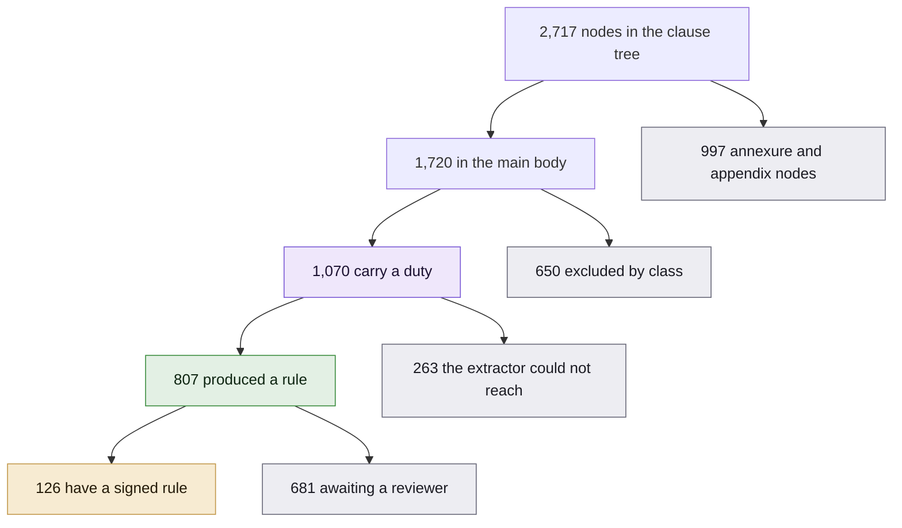

The grey boxes are the ones a sceptical reader should look at, because they are
exactly what a less careful tool would quietly drop from its denominator to
flatter its own percentage.

### The definition

```
                  clauses with at least one CERTIFIED obligation
clause coverage = ---------------------------------------------
                            obligation bearing clauses
```

### The interesting half is the denominator

*Obligation bearing* cannot mean *whatever the extractor touched*, because that
makes coverage **self grading**.

Think it through: an extractor that finds **fewer** duties would score
**higher**, because its denominator would shrink along with its numerator. That
is exactly backwards, and it is how most coverage claims are constructed.

So it is a **classification of the clause itself**, computed independently of any
extraction result. A clause is obligation bearing when it contains a deontic verb
used to impose a duty.

| Excluded class | Count |
|---|---:|
| Recital | 457 |
| Heading | 98 |
| Too short | 59 |
| Definition | 13 |
| Cross reference | 12 |
| Consequence | 11 |
| **Total excluded** | **650** |

**1,720 parsed, 650 excluded, 1,070 in the denominator.**

The classifier is itself fallible, so it is reported with its **own accuracy**
measured against the gold set, at **95.0%**. That is the only defensible way to
quote a ratio built on a heuristic.

### Coverage as three numbers rather than one

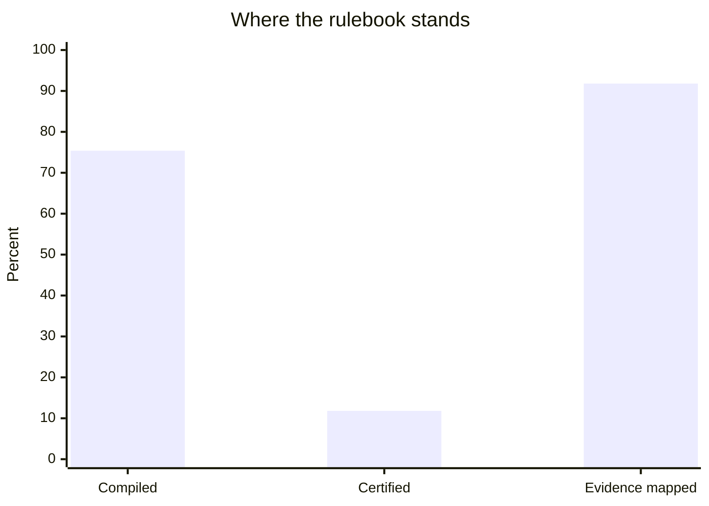

| Rung | Value | Of what | Limited by |
|---|---:|---|---|
| **Compiled** | **75.4%** | 807 of 1,070 duty bearing clauses | the extractor |
| **Certified** | **11.8%** | 126 of 1,070 duty bearing clauses | **reviewer hours, by design** |
| **Evidence mapped** | **91.8%** | 168 of 183 certified rules | whether the clause names an artifact |

**Read the middle number carefully.** It is low because certification is a human
act and one reviewer has finite hours. It is not the compiler failing.

Quote all three or none.

---

## 17. Determinism

The same PDF must always produce the same tree, or a rule signed on Tuesday
points at different words on Wednesday.

**Tree fingerprint**

```
3a0a41f5deee3fd1c909cfa5979eafb497804bc37b0c1b96ad8498d0a0c9e45d
```

It hashes every clause id, every span and every piece of text. Two runs over the
same bytes produce the same value, and `sanhita verify` proves it by parsing
twice and comparing all 2,717 nodes.

### PyMuPDF is pinned exactly, and this is not fussiness

Successive releases of the PDF library extract text differently.

Building the container once picked up **1.28.2** while development used
**1.27.2.2**. The same bytes of the same circular produced a different clause
tree, and therefore a different fingerprint.

Why that is serious:

- Every one of the **183 certifications** carries a SHA-256 of the clause text it
  was signed over, taken with 1.27.2.2
- On a different library version those hashes stop matching the text the parser
  now produces
- Signed rules then appear to point at clauses that changed, **when nothing
  changed at all**

Upgrading is allowed, but it is a **corpus migration**: re-parse, re-hash,
re-certify. It is not a version bump.

**The deploy pipeline fails if the live instance stops reproducing the
fingerprint.** A green build is not evidence that the site works, so the pipeline
checks the running thing.

---

## 18. Provenance

Every compiled artifact traces to an exact clause and its hash.

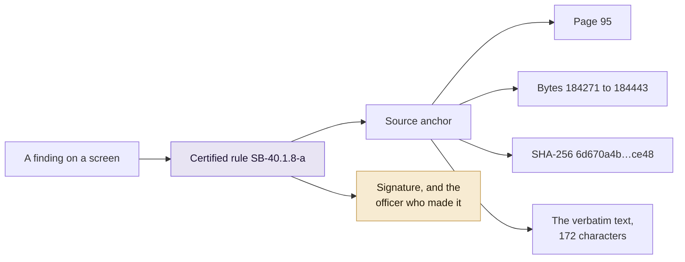

### Verbatim means verbatim

Curly quotes, rupee signs and non standard dashes are preserved **exactly** as
published.

**1,741 non ASCII characters**, kept rather than normalised, because a clause
hash covers the regulation's own characters. Normalising them would silently
change what was signed.

### Footnotes are lineage, not decoration

The circular carries **134 footnote definitions, of which 133 resolve to a
clause.**

Footnotes are where SEBI records **which earlier circular a clause came from**,
so they are the document's own history of itself. The one that does not resolve
is a cross reference to a paragraph rather than a dated circular, and it is
reported as unresolved rather than guessed at.

---

## 19. Accuracy, measured against a human

A tool that grades its own homework has measured nothing. So the gold set was
built by hand and ruled on by somebody who did not write the extractor.

### The results

| Metric | Score | n |
|---|---:|---:|
| Obligation detection, precision | 0.913 | 25 |
| Obligation detection, recall | 0.840 | 25 |
| **Obligation detection, F1** | **0.875** | 25 |
| Actor | 95.2% | 21 |
| Modality | 100% | 21 |
| Deadline kind | 100% | 21 |
| Evidence presence | 100% | 21 |
| Denominator classifier | 95.0% | 40 |

The four at 100% are measured over the clauses **both sides agree carry a duty**.

The gold set is **40 clauses**, of which 15 carry no obligation. That is a small
gold set and these figures carry that uncertainty. It is stated everywhere the
numbers are.

### The seven disagreements, and how they were settled

Seven of the forty labels were cases where the hand and the machine disagreed:

| Clause | Disagreement | Gold said | Machine said |
|---|---|---|---|
| 45.1 | False positive | no obligation | 1 obligation |
| 57.47 | False positive | no obligation | 1 obligation |
| 7.2.3 | Actor | `CLEARING_MEMBER` | `STOCK_EXCHANGE` |
| 19.5.2.3 | False negative | `MUST` | no deontic duty |
| 19.5.5.5 | False negative | `MUST` | no deontic duty |
| 54.4.2 | False negative | `SHOULD` | no deontic duty |
| 73.2.2 | False negative | `MAY` | no deontic duty |

They were settled by the project's owner rather than by the person who wrote the
extractor, because **a gold set signed off by its own author cannot measure
anything**.

**All seven were ruled in favour of the human label.** Every one therefore went
against the machine.

Had they gone the other way, detection would read **1.000 F1** and actor
**100%**. The lower number is published because it is the true one.

A test asserts that none of the seven can ever flip toward the extractor without
a recorded reason, so the score cannot be quietly improved later.

### Accuracy is gated on the human having ruled

Until all seven rulings are recorded and signed, the evaluation harness
**refuses to publish per field accuracy at all**. It reports
`AWAITING_HUMAN_RULINGS` instead of a number.

---

## 20. Performance

Every figure regenerates from `sanhita bench`. Nothing here is extrapolated: a
stage measured over 1,377 rules is reported over 1,377 rules.

| Stage | Time | What it did |
|---|---:|---|
| PDF to layout, cold | 1.13 s | 399 pages, 765,120 characters |
| Layout to clause tree, cold | 1.18 s | 2,717 tree nodes |
| Fingerprint the tree, warm | 1.6 ms | hashes every id, span and text |
| **Extract obligations** | **954 ms** | 1,377 obligations, about 1,444 a second |
| Load the signed store | 63 ms | 1,377 rules, 183 certified, 1,560 ledger entries |
| Verify the audit chain | 14 ms | 1,560 hash chained entries |
| Compute coverage | 153 ms | classifies 1,720 clauses |
| Generate a synthetic evidence set | 2.4 ms | 282 events, **synthetic, not a firm's books** |
| Run every certified rule | 2.8 ms | 279 occasions checked, 71 findings |
| Find contradictions | 7.0 ms | 141 pairs compared in full |
| Rank divergence risk | 6.2 ms | 807 clauses scored |
| Measure regulatory load | 1.5 ms | 6 actors, 1,377 rules |

**The synthetic row is labelled because the row under it depends on it.** Those
279 occasions and 71 findings are the engine run against generated events, which
is the only way to time the engine when no firm has given us their books. It is
a speed measurement and nothing else. **No compliance claim anywhere rests on
it.**

**Cold** means a freshly started process. **Warm** means the clause tree is
already in memory, which is what a person working the queue experiences all day.

### Deployed

Read off the Fly logs for a real rollout, one machine in Mumbai, shared 2 vCPU:

| | |
|---|---:|
| Image pulled and prepared | 12.3 s |
| Machine created and started | 18.5 s |
| **Init to the app serving** | **6 s** |
| Init to the health check passing | 13 s |

Six seconds from a cold machine to a process that answers, **including parsing a
399 page PDF and loading 1,377 rules**.

---

## 21. Every screen and what it answers

| Screen | The question it answers |
|---|---|
| **Document** | What could the parser read, and what could it not |
| **Queue** | What still needs a human decision |
| **Clause** | What does this clause say, and what rule came out of it |
| **Coverage** | How much of the rulebook is actually operational |
| **Gaps** | Where is this firm out of compliance, and who signed the rule |
| **Remediation** | Who is fixing it, by when, and has it actually closed |
| **Audit** | The hash chained history of every decision ever made |
| **Operational mapping** | Clause to process to team to system to control |
| **Contradictions** | Where does the circular disagree with itself |
| **Divergence** | Which clauses will two firms read differently |
| **Regulatory load** | What does this circular cost a firm per year |
| **Forecast** | What is about to be missed |
| **Impact assessment** | What would this amendment do, before publication |
| **Amendments** | What changed, what this firm must do, and one plan to approve or decline |
| **Check SEBI now** | What sebi.gov.in is listing that this installation does not have |
| **Company overview** | Where this firm stands, and whether a later edition sits unread |
| **Company evidence** | Are the firm's records still arriving, or did they stop in March |
| **Supervisor** | Every firm on this installation, and what is known about each |
| **Facts** | Every number we claim, read live from the store |

### The interaction that carries the whole product

On the clause screen, **hover any compiled field** on the right and the words
that justified it light up in the SEBI text on the left.

Two overlapping fields both stay visible, because a naive implementation that
wraps spans in tags loses one of them when they nest. The text is reproduced
**exactly**, with markup around it and never inside it, and a test asserts the
segments rejoin to the original character for character.

**If nothing lights up, the field has no textual basis and you should not sign
it.**

### The regulatory watch, and what it is not

There is a **"Check SEBI now"** button. When a person presses it, it reads
sebi.gov.in's own circulars listing.

Being precise about this, because it is easy to overclaim:

- Only `sebi.gov.in`, https only, and the host is re-checked **after redirects**
- There is **no scheduler, no daemon and no background fetch**
- Nothing is fetched on page load
- **This is not real-time monitoring** and the product never calls it that
- **Discovery never ingests.** A found circular is a title, a date, a link and a
  hash. Bringing it in is a person's decision

The **regulatory watch** is a separate thing again. It looks at documents already
on this installation and says, on every load, whether a later edition of a
declared rulebook is on file and has never been compared against the one in use.

### What every screen refuses to do

- No search box
- No question box
- No chat
- No LLM call at evaluation time
- No fabricated number anywhere, and where data is generated rather than real,
  the screen says so in a warning box, including the seed

---

## 22. Honest limits

Stated here rather than buried, because a limitation you have to go looking for
is a limitation you are hiding.

### No firm has given us their books

A gap report needs a firm's own filing records, and this installation has
whatever has been uploaded to it.

There is **no fallback to generated events**. A firm with no records is told it
has none and offered the upload, rather than shown a compliance percentage
computed from a random number generator.

Generated events exist for demonstrating the engine, behind an explicit
`?demo=1`, and every screen using them says so.

### The gold set is forty clauses

Small. Every arguable label was ruled against the machine. The figures carry that
uncertainty and it is stated wherever they appear.

### No solver reads the conditions

931 of them, 94 containing a comparator and a number. The other 837 are judgement
gates, and nothing formal can be built on top of them yet.

### Every rule came from the deterministic extractor

Zero LLM extractions in the shipped store. The model path exists, works, and
produced none of the 1,377.

### The parser was built on one circular and tested on eleven

Seven master circulars and four ordinary ones, **8,871 clause tree nodes between
them**:

| Document | Nodes |
|---|---:|
| Mutual funds, March 2026 | 2,620 |
| Stock brokers, June 2025 | 2,717 |
| Depositories, December 2024 | 1,795 |
| Investment advisers, February 2026 | 438 |
| Investment advisers, June 2025 | 420 |
| Research analysts, February 2026 | 427 |
| Research analysts, June 2025 | 342 |
| Transmission of securities, July 2026 | 87 |
| Intraday borrowing by MFs, July 2026 | 14 |
| SIF certification, July 2026 | 6 |
| Timeline extension, August 2026 | 5 |

Two real defects surfaced doing that, and both are fixed.

### Only one real amendment has been replayed, not twenty

An earlier deck claimed 20+. The true number was zero, and is now one: the
Investment Advisers Master Circular of June 2025 against its February 2026
reissue.

### Supervisory demonstrations across several firms are synthetic

This installation holds one firm. Five firms named "Firm A" to "Firm E" sit
behind an explicit switch, labelled before anything else on the screen, never
written to disk, and never counted in a published figure.

### Predicted divergence and observed divergence are different claims

The analysis reads a clause and predicts it will be understood two ways, and that
is computed from the real circular. Firms **actually** recording different
readings is the other half, and the only version of that here is synthetic.

### The key the 183 signatures were made with is lost

`/audit/verify` reports **183 checked, 0 valid**, on this machine and on the live
site.

- The rules, their clause hashes and the ledger chain are all intact and all
  still verify
- What is gone is the **separate cryptographic proof** that the signed bytes are
  unaltered
- Recomputing the signatures under a new key would turn that endpoint green while
  quietly making a **different claim**, so it has not been done
- The Facts page states this on screen rather than leaving a reviewer to find it

### A signature covers the rule's content, not the officer's identity

One HMAC key belongs to the **deployment** rather than to each officer. So a
signature proves the rule has not changed since it was signed, and proves nothing
cryptographic about **who** signed it.

Certifying, rejecting and amending require an account and record that account,
rather than accepting a name typed into a box. But a per-officer key is a real
change to the trust model and is **not claimed**.

### Evidence import reads CSV, JSON, XLSX and PDF

A CSV or JSON export that names the requirement becomes evidence directly. A
spreadsheet or a report usually names nothing, so what is found is held as a
**candidate for a person to confirm** rather than guessed at.

---

## 23. How Problem Statement 2 is answered

| What PS 2 asks for | How Sanhita answers it |
|---|---|
| Interpret a new or amended requirement | Layout reader and clause tree turn a PDF into typed obligations with byte level provenance |
| Map it to operational processes | Clause to process to function to system to control, recorded in the firm's own words, never inside the signed bytes |
| Update compliance workflows | An amendment produces a plan of named actions, each closing on a verifiable fact rather than an assertion |
| Track existing obligations | A versioned rule lifecycle with point in time replay, and a queue of what still needs a decision |
| Map each obligation to evidence | `EvidenceReq` on every rule, at 91.8% of certified rules, with the shortfall visible rather than hidden |
| Maintain audit trails | Two hash chained append only ledgers, one for certification and one for remediation |
| Identify gaps | A deterministic engine that distinguishes breach from unknown, and never counts silence as a pass |
| **Remediate gaps** | Tasks nobody can close by asserting. The only path to closed is re-running the rule |
| Specify intermediary and corpus | Stock brokers, SEBI Master Circular of 17 June 2025, committed to the repository |
| Demonstrate a concrete scenario | A real SEBI amendment carried end to end, plus a full gap to closed loop through the routes |

### The three claims we would stake the submission on

**One.** A compliance verdict here is reproducible, attributable and traceable to
an exact clause and hash. Not usually. Always. There is no model in the loop when
the question is answered.

**Two.** The hardest part of Problem Statement 2 is amendments, and this is the
only part of the system tested against a document SEBI actually reissued. 376
clauses moved, 25 signatures broke, 82 pieces of work landed on a named person,
and the tool closed none of them by itself.

**Three.** Every number in this document regenerates from a command, and three of
them were wrong until they were audited against the code and corrected. A tool
whose whole argument is that an answer must be traceable does not get to hold its
own documentation to a lower standard.

---

**Live at [sanhita.fly.dev](https://sanhita.fly.dev)** · Built for SEBI
Securities Market TechSprint 2026, Problem Statement 2.
